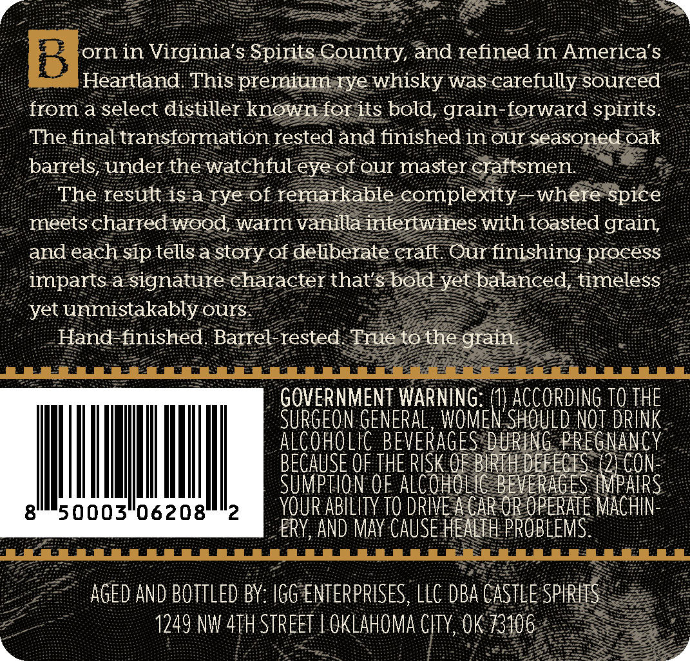
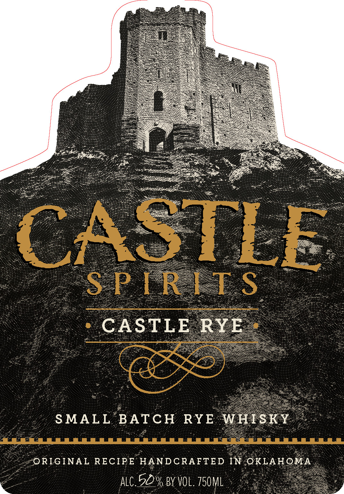
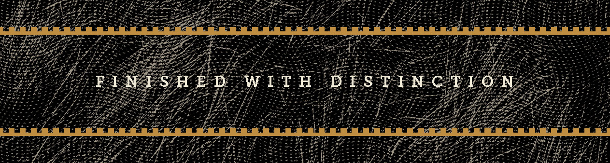

# TTB COLA Label Images - TTBID 26112001000333

**Brand Name:** CASTLE SPIRITS

**Fanciful Name:** CASTLE RYE

**Issue Date:** 04/24/2026

**Origin Code:** 37

**Product Class/Type:** 142

**Source:** [TTB Public COLA Registry](https://ttbonline.gov/colasonline/viewColaDetails.do?action=publicFormDisplay&ttbid=26112001000333)

## Label Images

### Back Label

### Front Label

### Label 3

## Extracted Label Text

*Text extracted via OCR - may contain errors*

### Back Label

orn in Virginia's Spirits Country, and refined in America's
Heartland This premium rye whisky was carefully sourced
from a select distiller known for its bold; grain-forward spirits
The final transformation rested and finished in our seasoned oak
barrels, under the watchful eye of our master craftsmen
The result is a rye of remarkable complexity
where
meets charred wood, Warm vanilla intertwines with toasted grain
and each sip tells a story of deliberate craft Our finishing process
imparts a signature character that's bold yet balanced, timeless
unmistakably ours
Hand-finished. Barrel-rested
True to the grain
GOVERNMENT WARNING=
ACCORDING TO THE
SurGeon GENERAL , WOMEN' SHOULD not drInk
Alcoholic BEVERAGES DURInG PREgnancy
BECAUSE OF THE RISK OF BIRTH DEFECIS (2) Con
Sumption oF alcoholIc BEVERAGES IMPAIRs
8
50003*06208
2
YOUR AbilIty TO DRIVE A CAR OR OPERATE Machin-
ERY, AND May CAUSE hEALth PROBLEMS
AGEd AND BOTTLED BY: IGG ENTERPRISES, LLC DBA CASTLE SPIRITS
1249 NW 4TH STREET
OKLAHOMA CITY,OK 73106
spice
yet

### Front Label

CASTLE
S P [ RIT$
CASTLE
RYE
SMALL
BATcH
RYE
WHISKY
ORIGINAL RECIPE HANDCRAFTED IN OKLAHOMA
alc 50.% BY VOL_ 750ML

### Label 3

5: RABEL AAA TEE LE Gh ee RET PE Tir EEE PUI TEEPE i ge ght
a Pe BERET, 27 ES ee RRR aE cu aearemIes
ESET SRI Bee ARS eS Ce TI er Oa cee RRR CEN OFS as TRIER TEER EL AT OR Soe OE
Reet OS eee (pe cena WE With we Betis coat y tort ers eee ee eee
ee : S3 (ED WITH DESTIN! MOM
SHEET TELL SGE SRG TG Zee TREY: SSN 27s 1 cg Bak Geoet Se ets EE eae a teas
Peet irs: esis Spee ced pag th hha ge fides 23: APPEAR RS Gf ie Ge Sen Gite a rf ikd
TS oP ae EE EER fhe ae ET EMG Lee eee
PLE BEE PETS SOO ENR A oe age PAE Lf
LIPS EE GEG EOL EYE EDEL YOO EEE EE a ir gm ber TeR RM gs Spee
PELE Gt he AE fo PP EAE EE Fe FEE
epee tas Aue etre eae ats LW ne ge AES, SERSTIILIME SE he gest Ed BE Le PAGEL
