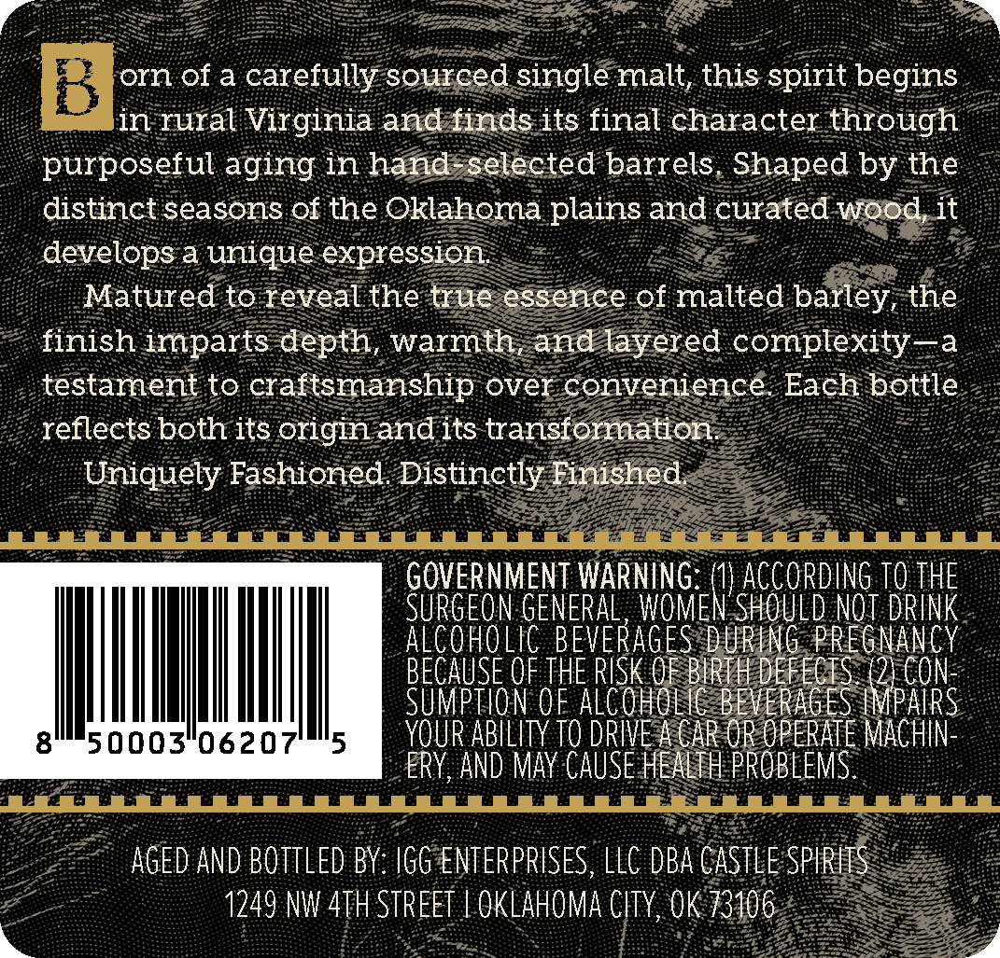
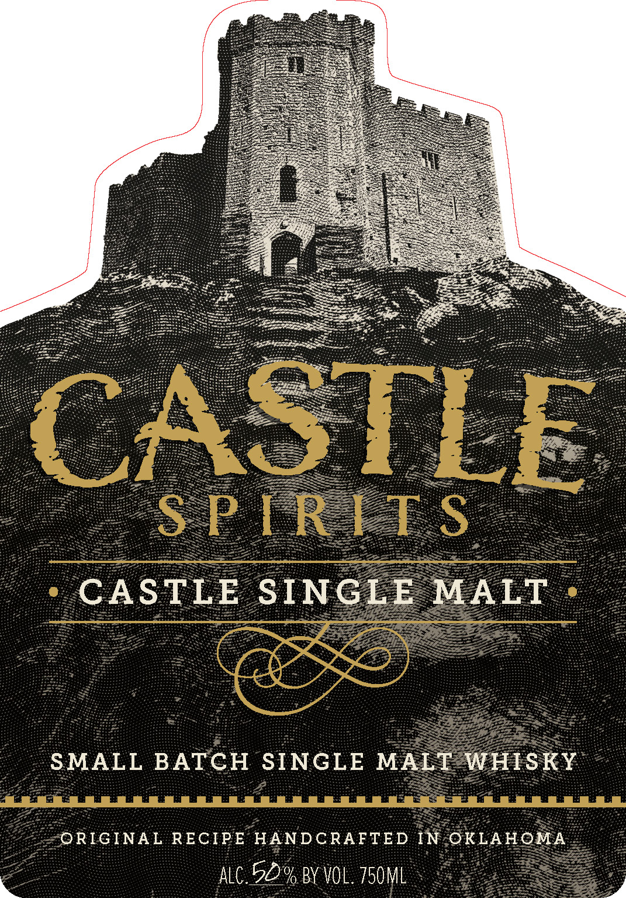

# TTB COLA Label Images - TTBID 26112001000345

**Brand Name:** CASTLE SPIRITS

**Fanciful Name:** CASTLE SINGLE MALT WHISKY

**Issue Date:** 05/01/2026

**Origin Code:** 37

**Product Class/Type:** 118

**Source:** [TTB Public COLA Registry](https://ttbonline.gov/colasonline/viewColaDetails.do?action=publicFormDisplay&ttbid=26112001000345)

## Label Images

### Back Label

### Front Label

### Label 3

## Extracted Label Text

*Text extracted via OCR - may contain errors*

### Back Label

B
orn of a
carefully sourced single malt, this
begins
in rural Virginia and finds its final character through
purposeful aging in hand-selected barrels Shaped
the
distinct seasons of the Oklahoma plains and curated wood it
develops a unique expression
Matured to reveal the true essence of malted barley, the
finish imparts depth
warmth, and layered complexity-a
testament to
craftsmanship over convenience
Each bottle
reflects both its origin and its transformation
Uniquely Fashioned Distinctly Finished
GOVERNMENT WARNING=
ACCORDING TO THE
SurGeon GENERAL , WOMEN' SHOULD not drInk
Alcoholic BEVERAGES DURInG PREgnancy
BECAUSE OF THE RISK OF BIRTH DEFECIS (2) Con
Sumption oF alcoholIc BEVERAGES IMPAIRs
50003"0620
YOUR AbilIty TO DRIVE A CAR OR OPERATE Machin-
ERY, AND May CAUSE hEALth PROBLEMS
AGEd AND BOTTLED BY: IGG ENTERPRISES, LLC DBA CASTLE SPIRITS
1249 NW 4TH STREET
OKLAHOMA CITY,OK 73106
spirit
by

### Front Label

CASTLE
S P RIT$
CASTLE
SINGLE
MALT
SMALL
BATCH
SINGLE
MALT
WHISKY
ORIGINAL RECIPE HANDCRAFTED IN OKLAHOMA
alc 50% BY VOL. 750MLl

### Label 3

22 PRE EL Ig ASEH fas Ps Se Ee asf tarts San Pe of BITE ST 4 rt er EIR as EY 7, 7
UB DEE ES Be ey FEL UR A PU RTA
an ‘i see i eee ee preeecieeer es pee ioe aaa SOF Gee eee ‘é: Bate ‘ Peart eee
MEET EEE EO OTE COE LE RE pare aR
DB Le oe EA Of E SI A E p o oP ee ih ak Se
Ee ae te TPE Se Les pf Remianerente i UR SE PE Se
GEL to LES ee PI en Oe ae he nS LD CTS Li Re ID
Ey apf fio ce fe SPR HP Ee PEA PREC TOT Ie Dene te eee
eae eee Gs pe ita POG Beh Ee Fa roee Ponce CRRTS TEIN CLIAT Cay © at wg cee ee
BO OPED BECERRA IE RA Ep ee RP eM TOEOOL ME eee
Be ae fewe ee ee: LEN EE Be E2D: WT THe NTENTLO? LEAR ERE: op.
EEE SPEER SBOE Fo EE) O85 Rob Gee ep
ee Lg GEES, EPG aera Ta ae meee PYRE EE a
gt Di BEIGE Df SPA Be Pe Cire ee gs
; fe oe ae PAVE ia PRT PE BRT On re A eS a ORE,
LEE LES GEG TPO EYEE LE EE: PR EEO TE EGE TEGES ar ree 134 z
SESE Lae Ae PIAS Sager a re ETAT SEE fee eee aeT Io PAE RS Be sik Pe
Sle a2 Ase ee AT ES fee APR EF pr creees ebay Meter age Setter ior eee Si PSE eet
BSE hs! fogs eat A REA IOGEAR STL SE et aa Be gee eee el se ae
