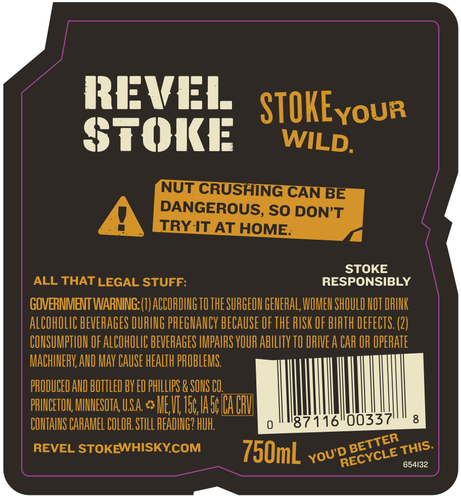
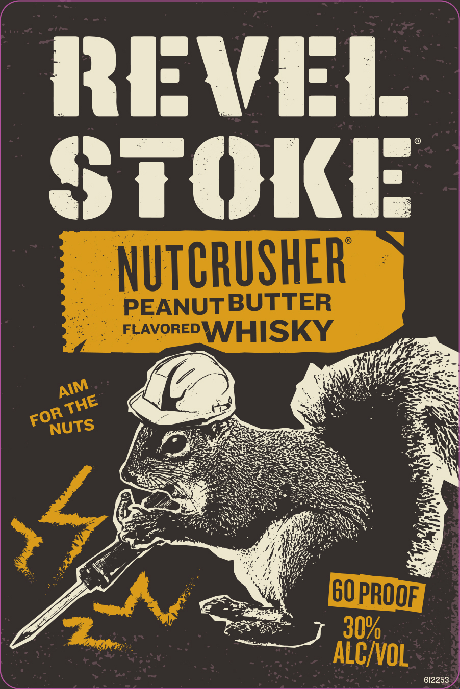

# TTB COLA Label Images - TTBID 26112001000388

**Brand Name:** REVEL STOKE

**Fanciful Name:** NUTCRUSHER

**Issue Date:** 04/23/2026

**Origin Code:** 27

**Product Class/Type:** 149

**Source:** [TTB Public COLA Registry](https://ttbonline.gov/colasonline/viewColaDetails.do?action=publicFormDisplay&ttbid=26112001000388)

## Label Images

### Back Label

### Label 1

## Extracted Label Text

*Text extracted via OCR - may contain errors*

### Back Label

[

Fae

REVEL.

STOKEyour

STOKE

WILD

NUT CRU

HING CAN

DANGEROUS, SO DON’T

TRY IT AT HOME

ALL THAT LEGAL STUFF:

RESPONSIBLY \

GOVERNMENT WARNING: (1) ACCORDING TO THE SURGEON GENERAL, WOMEN SHOULD NOT DRINK

ALCOHOLIC BEVERAGES DURING PREGNANCY BECAUSE OF THE RISK OF BIRTH DEFECTS. (2)

CONSUMPTION OF ALCOHOLIC BEVERAGES IMPAIRS YOUR ABILITY T0 DRIVE A CAR OR OPERATE

MACHINERY, AND MAY CAUSE HEALTH PROBLEMS

PRODUCED AND BOTTLED BY ED PHILLIPS & SONS CO.

PRINCETON, MINNESOTA USA. <> MEV, Toe SICA CRI

CONTAINS CARAMEL COLOR STILL READING? RU

0

87

6 ee

8

REVEL STOKEWHISKY.COM

750mL youeeeyete ETH:

ae

654132

EE —

### Label 1

{ ij [ C | |
Nite
ld Ms ultgge die -
RAVAN Ete S, 6 ot
BERN 04/202, eae
BAERS 2.0, 7 See
‘SSRIS aie SSS
<i NN
é A . Fe NS
ih ae, 4 NST Ee WH
Me 8s NN
Pde sf SPT IN Ee ee \
hiteeR (Le RS ABS > = SN ,
RDP eee SERN CRT TEAS DENCY « a
RENE FS NES > hy
ERS a ERS PISS. a
SR NRA ESSE SSS 3
ae. BS SSS =-
ie FARE SNES OTT SSSA =o
eee) ND SS, —.
PE TEP NS et sey - es
ae 7 «(Ve =
Ae he Og
ons ae) Ne SEs
ye eee MY 5. 7
LE te All Gey
SZ 2p ae =
by Se
Y a ~
iy EF
fi SES
612253
