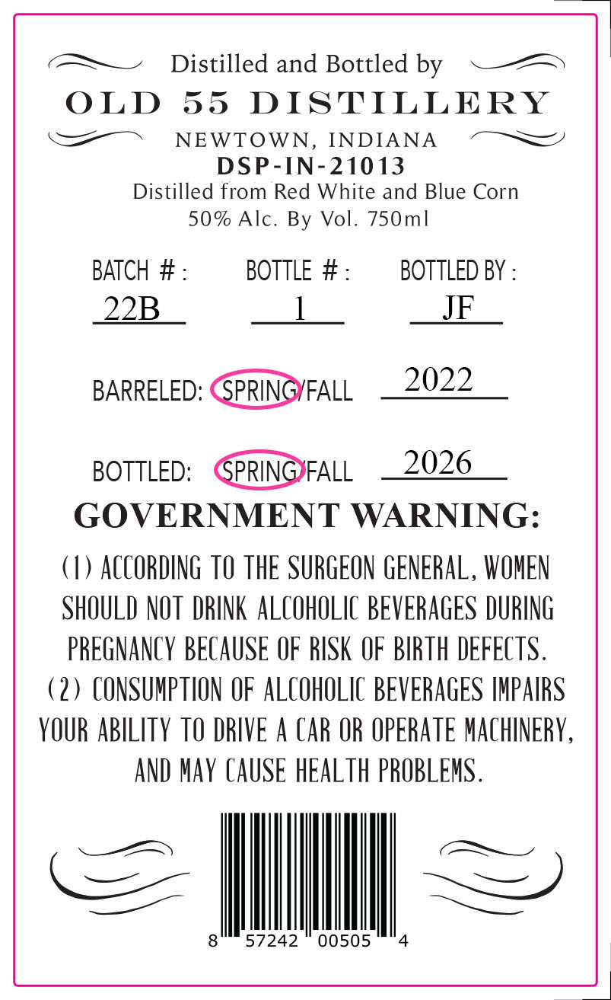

# TTB COLA Label Images - TTBID 26112001000535

**Brand Name:** OLD 55

**Fanciful Name:** BOURBON

**Issue Date:** 05/11/2026

**Origin Code:** 19

**Product Class/Type:** 111

**Source:** [TTB Public COLA Registry](https://ttbonline.gov/colasonline/viewColaDetails.do?action=publicFormDisplay&ttbid=26112001000535)

## Label Images

### Front Label

## Extracted Label Text

*Text extracted via OCR - may contain errors*

**Detected Proof:** 100

### Front Label

Distilled and Bottled by
OLD
55
DISTILLERY
NEWTOWN,
INDIANA
DSP-IN- 21013
Distilled from Red White and Blue Corn
50% Alc. By Vol. 750ml
BATCH #
BOTTLE # :
BOTTLED BY
22B
JF
BARRELED:
SPRINGYFALL
2022
BOTTLED:
SPRINGYFALL
2026
GOVERNMENT WARNING:
(I) ACCORDING TO THE SURGEON GENERAL, WOMEN
SHOULD NOT  DRINK   ALCOHOLIC BEVERAGES DURING
PREGNANCY BECAUSE OF RISK OF BIRTh DEFECTS .
(2) CONSUMPTION OF ALCOHOLIC BEVERAGES IMPAIRS
YOUR ABILITY TO DRIVE A CAr OR OPERATE MAChINERV,
AND Mav CAUSE HEALTh PROBLEMS .
57242
00505
