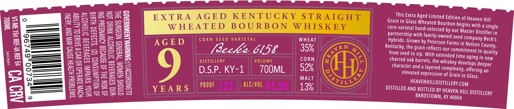
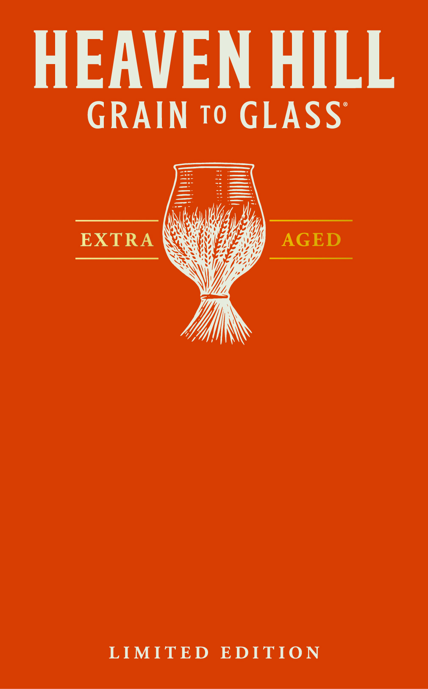

# TTB COLA Label Images - TTBID 26112001000539

**Brand Name:** HEAVEN HILL

**Fanciful Name:** GRAIN TO GLASS EXTRA AGED

**Issue Date:** 05/06/2026

**Origin Code:** 22

**Product Class/Type:** 101

**Source:** [TTB Public COLA Registry](https://ttbonline.gov/colasonline/viewColaDetails.do?action=publicFormDisplay&ttbid=26112001000539)

## Label Images

### Label 1

### Label 2

### Label 3

## Extracted Label Text

*Text extracted via OCR - may contain errors*

*1 image(s) excluded: text did not meet readability threshold*

### Label 1

This Extra Aged Limited Edition of Heaven Hill
Grain to Glass Wheated Bourbon begins with a single
es ae corn varietal hand-selected by our Master Distiller in
=a Best aeez Hybrids. Grown by Peterson Farms in Nelson County,
3 oO =a= a ‘i .
eS ——— Seaess23a = WHEAT Kentucky, the grain reflects our commitment to quality
ee ————d Sia Ses a m 35% from seed to sip. With extended time aging in new
4 eam See a Ss Se — [Becher OLDE charred oak barrels, the whiskey develops deeper
a Sat as me CORN character and a layered complexity, offering an
a > = i, elevated expression of Grain to Glass.
y —eeee Bers L (0)
& hee —— Tee SssocLle KY-1 700M
2 Sa FS ae D.S.P. HEAVENHILLDISTILLERY.COM
2S — S2e2aS2s= 2. MALT
— —— SS35e352=38 0 DISTILLED AND BOTTLED BY HEAVEN HILL DISTILLERY
Cc i ss J/o (} BARDSTOWN, KY 40004
Om | zmes 123
= = Eee 2oes
— BSesoseEs
_ ee = 7
— =| as

### Label 3

HEAVEN HILL
GRAIN
To GLASS
EXTRA
AGED
LIMITED
EDITION
