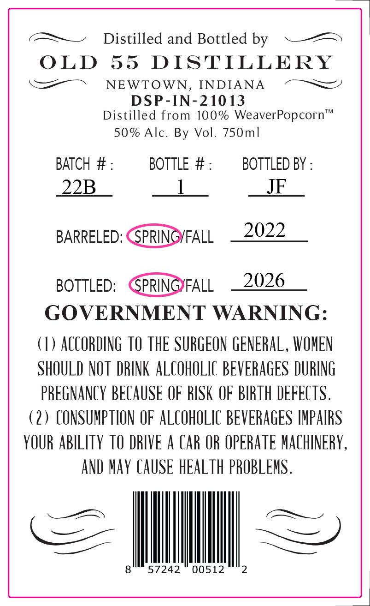
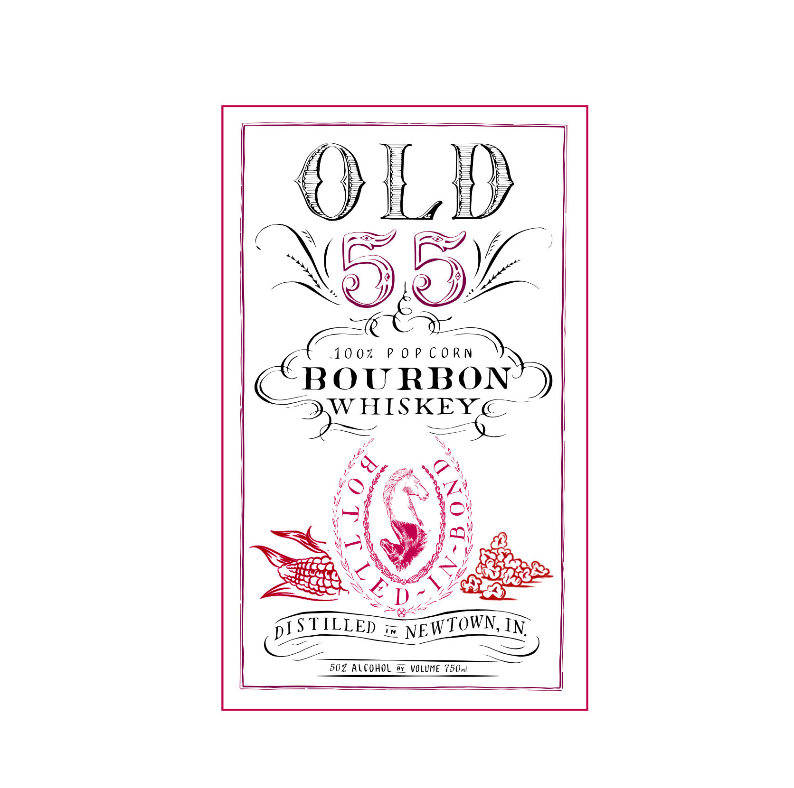

# TTB COLA Label Images - TTBID 26112001000556

**Brand Name:** OLD 55

**Fanciful Name:** POPCORN BOURBON

**Issue Date:** 05/04/2026

**Origin Code:** 19

**Product Class/Type:** 111

**Source:** [TTB Public COLA Registry](https://ttbonline.gov/colasonline/viewColaDetails.do?action=publicFormDisplay&ttbid=26112001000556)

## Label Images

### Back Label

### Label 1

## Extracted Label Text

*Text extracted via OCR - may contain errors*

*1 image(s) excluded: text did not meet readability threshold*

**Detected Proof:** 100

### Back Label

(—~—~ Distilled and Bottled by

————

OLD

55 DISTILLERY

=a ~ NEWTOWN, INDIANA ~~

DSP-IN-21013

Distilled from 100% WeaverPopcorn

50% Alc. By Vol. 750m|

BATCH #

BOTTLE #

BOTTLED BY

22B

1

JF

2022

BARRELED: CSPRINGYFALL

2026

BOTTLED: GPRING)FALL

GOVERNMENT WARNING

1) ACCORDING TO THE SURGEON GENERAL, WOMEN

SHOULD NOT DRINK ALCOHOLIC BEVERAGES DURING

PREGNANCY BECAUSE OF RISK OF BIRTH DEFECTS

(2) CONSUMPTION OF ALCOHOLIC BEVERAGES IMPAIRS

YOUR ABILITY TO DRIVE A CAR OR OPERATE MACHINERY

AND MAY CAUSE HEALTH PROBLEMS.

= Il

8 57242 00512 2
