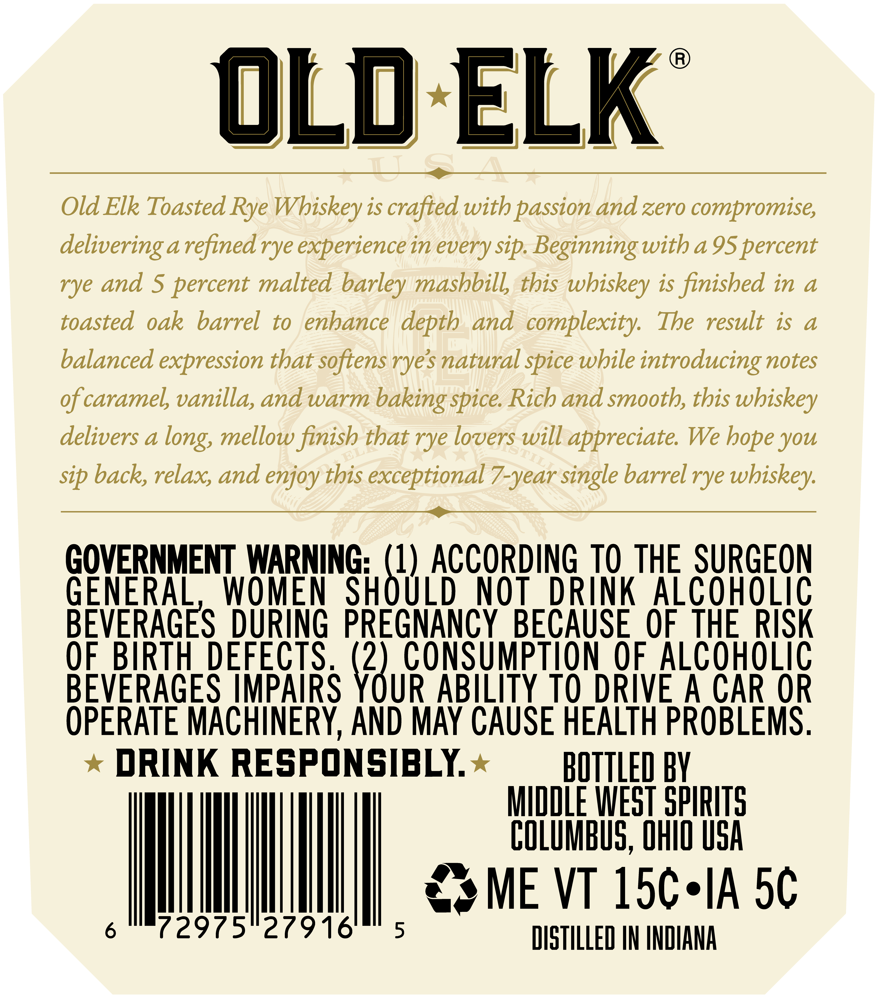
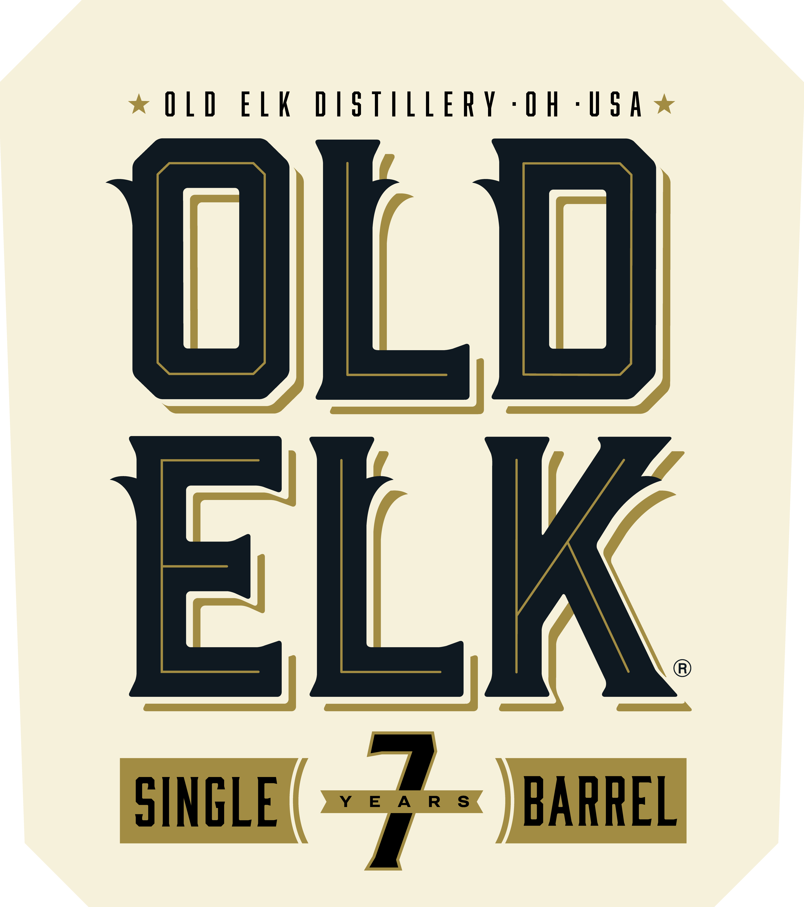
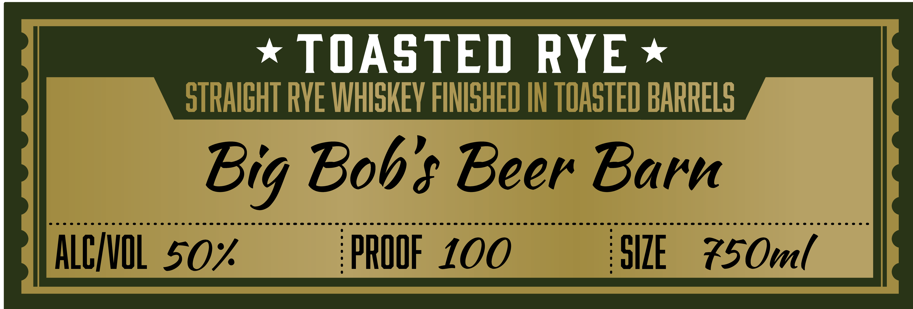

# TTB COLA Label Images - TTBID 26112001000564

**Brand Name:** OLD ELK

**Issue Date:** 04/27/2026

**Origin Code:** 09

**Product Class/Type:** 102

**Source:** [TTB Public COLA Registry](https://ttbonline.gov/colasonline/viewColaDetails.do?action=publicFormDisplay&ttbid=26112001000564)

## Label Images

### Back Label

### Front Label

### Label 2

### Label 3

## Extracted Label Text

*Text extracted via OCR - may contain errors*

*1 image(s) excluded: text did not meet readability threshold*

**Detected Proof:** 100

### Back Label

Old ELK
Old Elk Toasted Rye Wbiskey is crafted with passion and zero compromise;
delivering arefinedrye experience in every sip  Beginningwith a 95 percent
rye and $ percent malted barley mashbill this wbiskey is finished in a
toasted oak
barrel
to
enhance depth and complexity:
The result is
a
balanced expression that softens ryes natural spice wbile introducing notes
ofcaramel vanilla, and warm baking spice Rich and smooth, this wbiskey
delivers a
long, mellow finish that rye lovers will appreciate We bope you
sip back, relax; and enjoy this exceptional 7-year single barrelrye whiskey:
GOVERNMENT WARNING: (1) ACCORDING TO THE SURGEON
GENERAL
WOMEN
SHOULD
NOT
DRINK AlcohoLiC
BEVERAGES DURING PREGNANCY
BECAUSE  OF  THE RISK
OF BIRTH DEFECTS (2) CONSUMPTION OF AlcOhOLIC
BEVERAGES IMPAIRS YOUR ABILITY TO DRIVE A CAR OR
OPERATE MACHINERY, AND MAY CAUSE HEALTH PROBLEMS ;
DRINK RESPONSIBLY
BOTTLED BY
MIDDLE WEST SPIRITS
COLUMBUS, OHIO USA
ME VT 15c-IA 5c
72975"27916"
5
DISTILLED IN INDHANA

### Front Label

OLD ELK DISTILLERY -OH -USA

ULU

ELK

SINGLE

72

BARREL

### Label 2

TOASTED
RYE
STRAIGHT RVE WHISKEV FINISHED IN TOASTED BARRELS
Bob$ Beer Barn
ALCIvIL 50%
PROOF 100
SIZE
Z5Oml
Big
