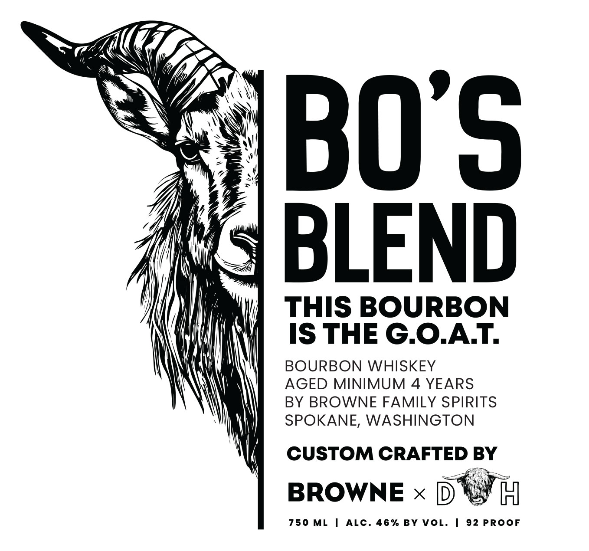
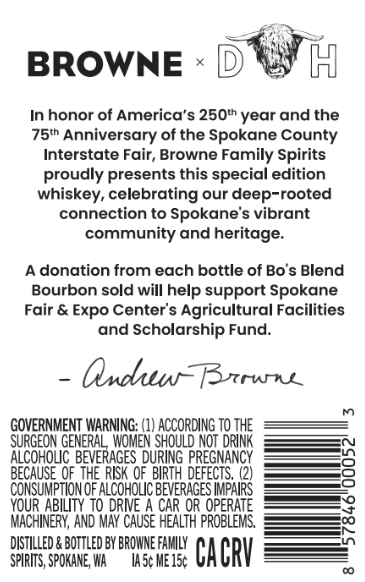

# TTB COLA Label Images - TTBID 26113001000185

**Brand Name:** BROWNE FAMILY SPIRITS

**Fanciful Name:** BO'S BLEND

**Issue Date:** 04/30/2026

**Origin Code:** 07

**Product Class/Type:** 141

**Source:** [TTB Public COLA Registry](https://ttbonline.gov/colasonline/viewColaDetails.do?action=publicFormDisplay&ttbid=26113001000185)

## Label Images

### Front Label

### Label 2

## Extracted Label Text

*Text extracted via OCR - may contain errors*

**Detected Proof:** 92
**Detected Age:** 4 Years

### Front Label

BO'S
BLEND
THIS BOURBON
IS THE G.OAT
BOURBON WHISKEY
AGED MINIMUM
4 YEARS
BY BROWNE FAMILY SPIRITS
SPOKANE, WASHINGTON
CUSTOM CRAFTED BY
BROWNE
750
ML
ALC_
4 6 %
BY VOL.
92 PROOF

### Label 2

BROWNE
In honor of America's 250t year and
75th Anniversary of the Spokane County
Interstate Fair; Browne Family Spirits
proudly presents this special edition
whiskey, celebrating our deep-rooted
connection to Spokane's vibrant
community and heritage:
A donation from each bottle of Bo's Blend
Bourbon sold will help support Spokane
Fair & Expo Center's Agricultural Facilities
and Scholarship Fund:
OxBsrnns
GOVERNMENT WARNING: (1) ACCORDING TO THE
SURGEON GENERAL, WoMen Should NOT DRIN
AlcoHolIc; BEVERAGES DURING PREGNANCY
BECAUSE OF' THE' RISK OF  BIRTH DEFECTS, (2)
CONSUMPTION OF ALCoHOc BEVERAGES IPAIRS
YOUR ABILITY to DRWE
CAR OR OPERATE
MACHINERY, AND May CAuSE HEALth problEMS,
DistIlleD & BOTTLED BY BROWNE FaKILY
SPIRITS, SPOKANE WA
Iasc MEIsc
Cacrv
the
