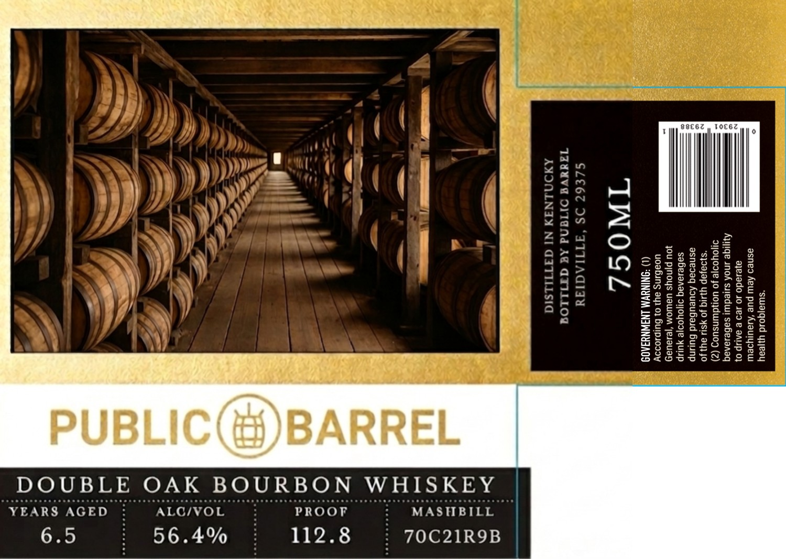

# TTB COLA Label Images - TTBID 26113001000195

**Brand Name:** PUBLIC HOUSE

**Issue Date:** 04/25/2026

**Origin Code:** 41

**Product Class/Type:** 141

**Source:** [TTB Public COLA Registry](https://ttbonline.gov/colasonline/viewColaDetails.do?action=publicFormDisplay&ttbid=26113001000195)

## Label Images

### Label 1

## Extracted Label Text

*Text extracted via OCR - may contain errors*

**Detected Proof:** 112.8

### Label 1

*swajqoid yyeay

asneo Aew pue ‘Auauiysew
ayesado 10 189 B BALIP 0}
Ayyige snof suedwi sabesanaq
dOYyooje Jo UONdwNsuOZ (Z)
“s}9a}ap YLIG Jo ¥SUU ay) JO
asnesaq Aoueubaid Buuunp
saBesanag o10yooje yup
}OU pjnoys Uawom ‘je1aUay
uoaBins ay2 0} Buipsoooy

(1) *SNINUVM LNAWNYIA0

"INOS

SLE67 DS “ATTIAGIIU
1adaVA OLIANd AC ATILLOG
J AXONLNIN Ni GITILLSIG

°

3
4
3

1

MASHBILL

70C21R9B

PROOF
112.8

‘ALG/VOL

DOUBLE OAK BOURBON WHISKEY

YEARS AGED
