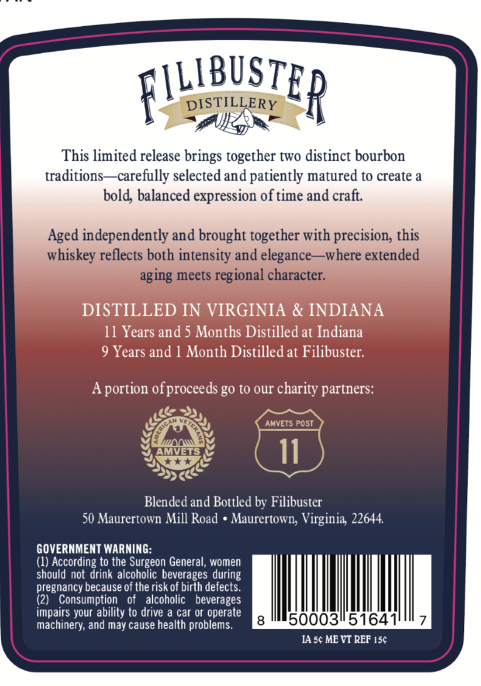
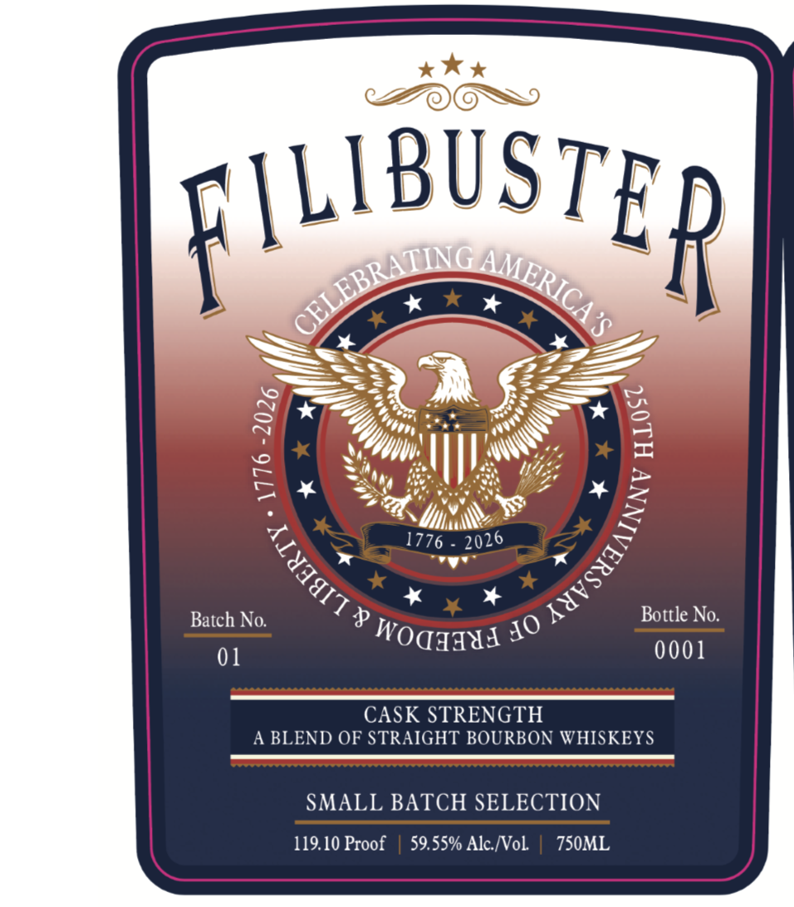

# TTB COLA Label Images - TTBID 26113001000359

**Brand Name:** FILIBUSTER

**Issue Date:** 06/04/2026

**Origin Code:** 05

**Product Class/Type:** 121

**Source:** [TTB Public COLA Registry](https://ttbonline.gov/colasonline/viewColaDetails.do?action=publicFormDisplay&ttbid=26113001000359)

## Label Images

### Back Label

### Front Label

## Extracted Label Text

*Text extracted via OCR - may contain errors*

**Detected Proof:** 119.1
**Detected Age:** 11 Years

### Back Label

[LLBUSTE
DISTILLERY
D
This limited release
together two distinct bourbon
traditions
~carefully selected and patiently matured to create a
bold; balanced expression of time and
Aged independently and brought together with precision; this
whiskey reflects both intensity and elegance
-where extended
aging meets regional character:
DISTILLED IN VIRGINIA & INDIANA
11 Years and 5 Months Distilled at Indiana
9 Years and
Month Distilled at Filibuster:
Aportion ofproceeds g0 to our charity partners:
AMVETS Post
11
Blended and Bottled by Filibuster
50 Maurertown Mill Road
Maurertown; Virginia 22644.
GOVERNMENT WARNING:
(1)
Oucs orai &rio t
to the Surgeon General, women
should not
alcoholic beverages during
pregnancy because of the risk of birth defects:.
(2)
Consumption
of
alcoholic   beverages
impairs your ability to drive & car or operate
machinery;
may cause health problems.
500031/516411
IA sc ME VT REF 156
brings
craft
and

### Front Label

FILIBUSTER
8
2
1776
Batch No:
p
Bottle No.
01
WOaIIUI
0001
CASK STRENGTH
A BLEND OF STRAIGHT BOURBON WHISKEYS
SMALL BATCH SELECTION
119.10 Proof
59.55% Alc Nol
7S0ML
CELEBRATING
AMERICA
1
3
)
1
2026
10
