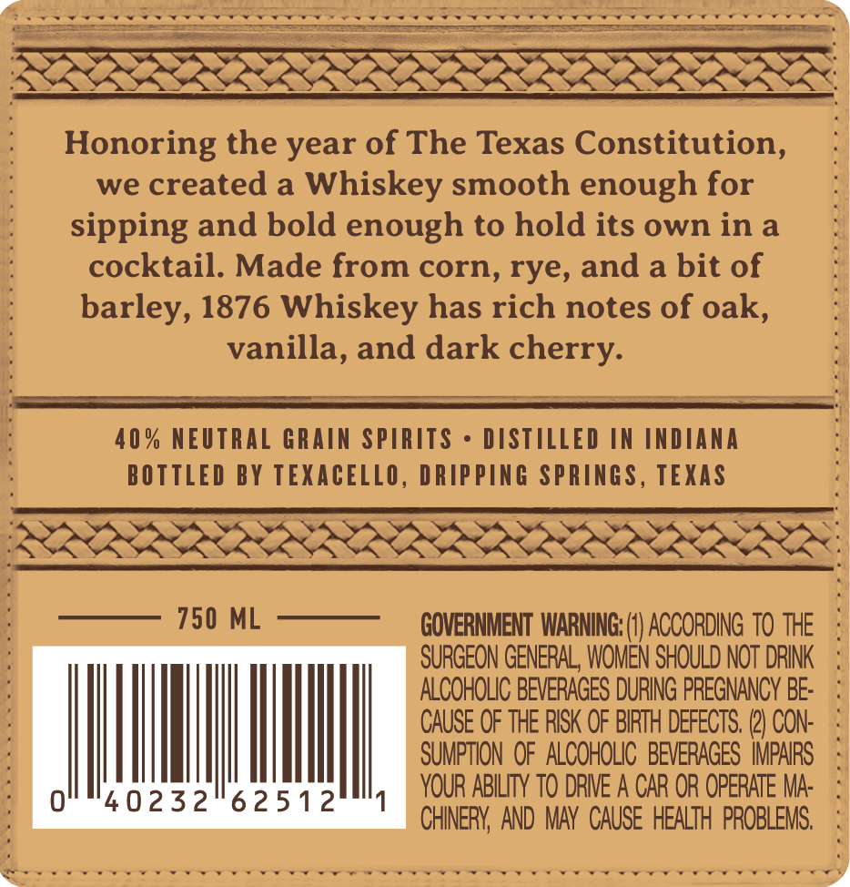

# TTB COLA Label Images - TTBID 26113001000576

**Brand Name:** 1876 BLENDED BOURBON WHISKEY

**Issue Date:** 04/27/2026

**Origin Code:** 44

**Product Class/Type:** 131

**Source:** [TTB Public COLA Registry](https://ttbonline.gov/colasonline/viewColaDetails.do?action=publicFormDisplay&ttbid=26113001000576)

## Label Images

### Front Label

## Extracted Label Text

*Text extracted via OCR - may contain errors*

### Front Label

vy

aa

wes

ee

eee Rane nenannheneeeneenannte

Se

aa

Honoring the year of The Texas Constitution,

we created a Whiskey smooth enough for

sipping and bold enough to hold its own ina

cocktail. Made from corn, rye, and a bit of

barley, 1876 Whiskey has rich notes of oak,

vanilla, and dark cherry.

=

_

=

—

=

40% NEUTRAL GRAIN SPIRITS - arr IN INDIANA

BOTTLED BY TEXACELLO, DRIPPING SPRINGS, TEXAS

750 ML

GOVERNMENT WARNING: (1) ACCORDING TO THE

SURGEON GENERAL, WOMEN SHOULD NOT DRINK

ALCOHOLIC BEVERAGES DURING PREGNANCY BE

CAUSE OF THE RISK OF BIRTH DEFECTS. (2) CON

SUMPTION OF ALCOHOLIC BEVERAGES IMPAIRS

YOUR ABILITY TO DRIVE A CAR OR OPERATE MA-

CHINERY, AND MAY CAUSE HEALTH PROBLEMS.

Sve ere

“
