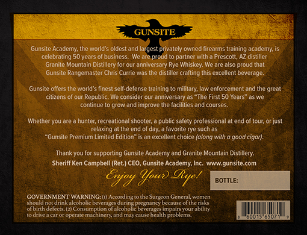
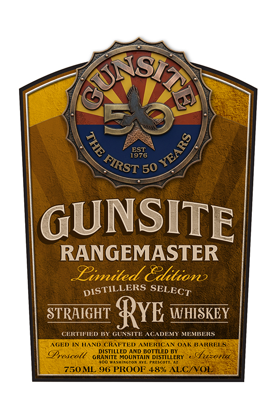

# TTB COLA Label Images - TTBID 26113001000620

**Brand Name:** GUNSITE RANGEMASTER

**Fanciful Name:** GUNSITE

**Issue Date:** 04/30/2026

**Origin Code:** 11

**Product Class/Type:** 102

**Source:** [TTB Public COLA Registry](https://ttbonline.gov/colasonline/viewColaDetails.do?action=publicFormDisplay&ttbid=26113001000620)

## Label Images

### Back Label

### Front Label

## Extracted Label Text

*Text extracted via OCR - may contain errors*

**Detected Proof:** 96
**Detected Age:** 50 Years

### Back Label

GUNSITE
Gunsite Academy; Ile world $ oldest and[
rgest privately owned firearms training academy:
celebrating 50 years e
business  Wle are proud t0 partner with -
Prescott; AZ distiller
Granite Mountain Distillery for Our annivcrsary Rye Whiskey: We arc also proud that
Gunsite Rangemaster Chris Currie was the distiller crafting Ihis excellent beverage
Gunsite offers the world $ finest self-defense training
military; law enforcement and the great
citizens =
Republic; We consider Our anniversary as "The First 50 Years" aswe
continite
grow and improve Ihe facilities and courses
Whethet you are
hunter; recreational shooter;
public satety professional
end oftour; Or just
relaxing at the end of day:a favorite rye such as
"Gunsite Premium Limited Edition" is an excellent choice (along with
good cigor):
Thankyou
supporting Gunsite Academy and Granite Mountain
Distillery:
Sheriff Ken Campbell (Ret ) CEO, Gunsite Academy; Inc.
gunsite_com
Ejey Iowv Sye!
BOTTLE:
GOVERNMENT WARNING: E
According tothe Surgcon Genctal wonen
should not drint
alcoholic bcrenag s
en
picenang
Ianeontnan
Obinthecc
cncumoticn
"88 stdoriok Ptegnaigey
Jmdi Youi
obiliry
Ae
opcrate machincr andmay cousc heahth
problenis:

### Front Label

EST
1976
50
GUNSITE
RANGEMASTER
Emited Zditiono
DISTILLERS
STRAIGHT
RyE
WHISKEY
CERTIFIED BY
GUNSITE ACADEMY MEMBERS
AGED IN HAND CRAFTED AMERICAN OAK BARRELS
DISTILLED AND BOTTLED BY
OPrescotl
GRANITE MOUNTAIN DISTILLERY
hion
Wealnalto
EEACOTT
750ML 96 PROOF 48% ALC/VOL
Ss13s
8
2
FIRST
SELECT
