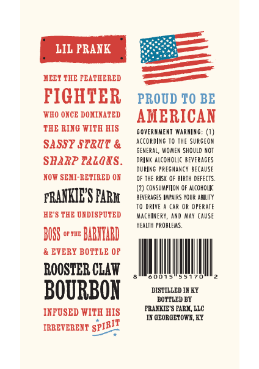
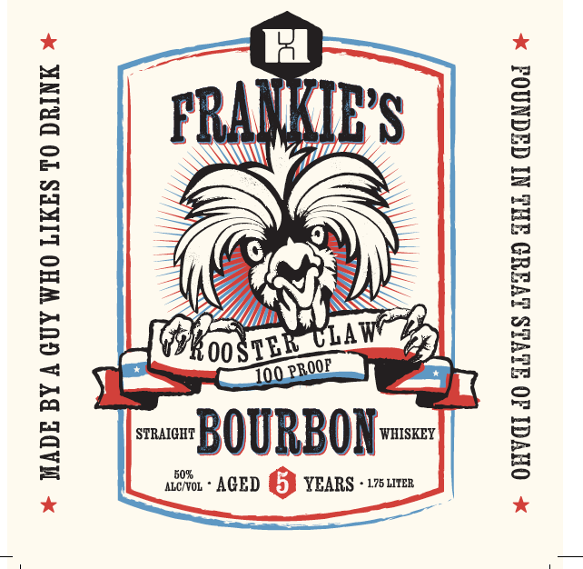

# TTB COLA Label Images - TTBID 26113001000636

**Brand Name:** FRANKIE'S

**Issue Date:** 05/12/2026

**Origin Code:** 22

**Product Class/Type:** 101

**Source:** [TTB Public COLA Registry](https://ttbonline.gov/colasonline/viewColaDetails.do?action=publicFormDisplay&ttbid=26113001000636)

## Label Images

### Back Label

### Front Label

## Extracted Label Text

*Text extracted via OCR - may contain errors*

### Back Label

LIL PRANK
HEET THE FEATHERED
FIGHTER
PROUD FO BE
WIO ONCE DOXIAATED
AMERICAN
THE RING WITH HIS
6 OVERHMENT Wabnimg=
SASSY STRUT &
according I0 Ihe Surseor
GENERAL,
WOMeN Shduld NOT
SBARP Eazoxs
DRIMK alcoholc beverages
dupine
Presnancy BEcaUSF
NOT SEMI-RETIRED ON
0F THE RISK D BIRTH DeF:cts.
cdnsumptlon OF ALcohollc
PRANKIES PARM
beverases Impairs Ydur ABILITY
To DRive
Car Or OPERATE
HE'S THE DNDISPDTED
Kachixery,
And May CaUse
hEALTH PRoblems:
BOSS
OF ILE
BARMYARD
EVERY BOTTLE OF
ROOSTBR CLAW
BOURBON
DISTILLED IX KTY
BOTTLED BI
INPUSED WITH HIS
FRLYKIE"S FAREL, LLC
IK GEORGETOWI, KY
IRREVERENT
'SPIRIT

### Front Label

%* MADE BY A GUY WHO LIKES T0 DRINK *

voy

i \

17,

7 “fpshiaad
BN G :

1." mu
sw BOURBON

wo. AGED GJ YEARS -17surex

% OHV dO GiVLS LVIUD FHL NI CICNMOd +
