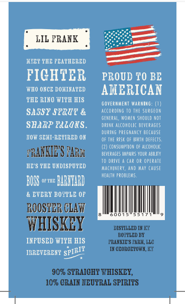
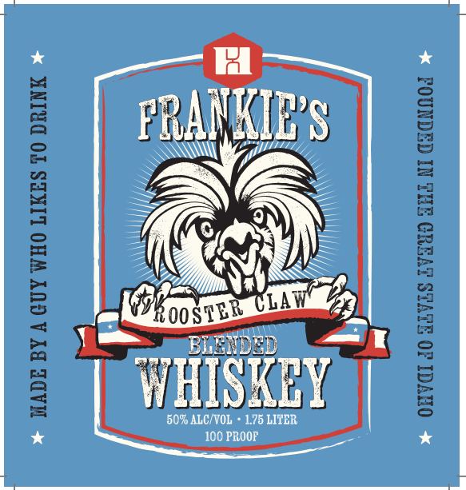

# TTB COLA Label Images - TTBID 26113001000644

**Brand Name:** FRANKIE'S

**Issue Date:** 05/11/2026

**Origin Code:** 22

**Product Class/Type:** 137

**Source:** [TTB Public COLA Registry](https://ttbonline.gov/colasonline/viewColaDetails.do?action=publicFormDisplay&ttbid=26113001000644)

## Label Images

### Back Label

### Front Label

## Extracted Label Text

*Text extracted via OCR - may contain errors*

*1 image(s) excluded: text did not meet readability threshold*

### Back Label

LIL PRANK
ICEY THE PEATHERED
FICHTER
PROUD T0 BE
WHO OKCE DOTINATED
AMCRICAN
THE RINC WiTH HIS
GOVERMMETT WaRMIMG
SASSY srrur &
according
TME surgeom
GENeRAL, WOmen Should NoT
SHARP Taza&s.
DRIMK Alcoholic beverages
during PREGMANCY BECAUSE
Yow SEMI-RETIRED ON
OF TMt eIst OF Blrin DEfFcTS,
(2) cOsumptioh OF ALcohOLIC
?RANIIE'S YARu
BEVERACES ImpaiRS YOUR ABIlify
TD orivE
Car Or operate
IIE"$ TIIE UMDISPUTED
Machinery, and May (Aust
HEALTH PROBLEMS.
BUSS
OP THE
BABHYARD
ETERY BOTYLE OF
ROOSTBR CLAT7
WZHISKEY
DISTILLED IA KX
BOZYLED BY
INPUSED WITH HIS
PRARKIE"S PARIL,KLC
IK CCORCETOWK,KZ
IRREVERENT
90% STRAICHT WHISKEY,
109 CRAIN NEUTRAL SPIRITS
SPIRIT
