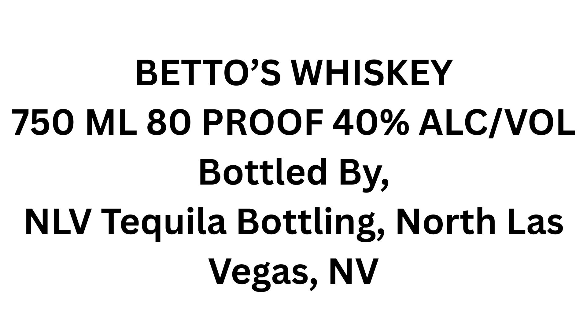
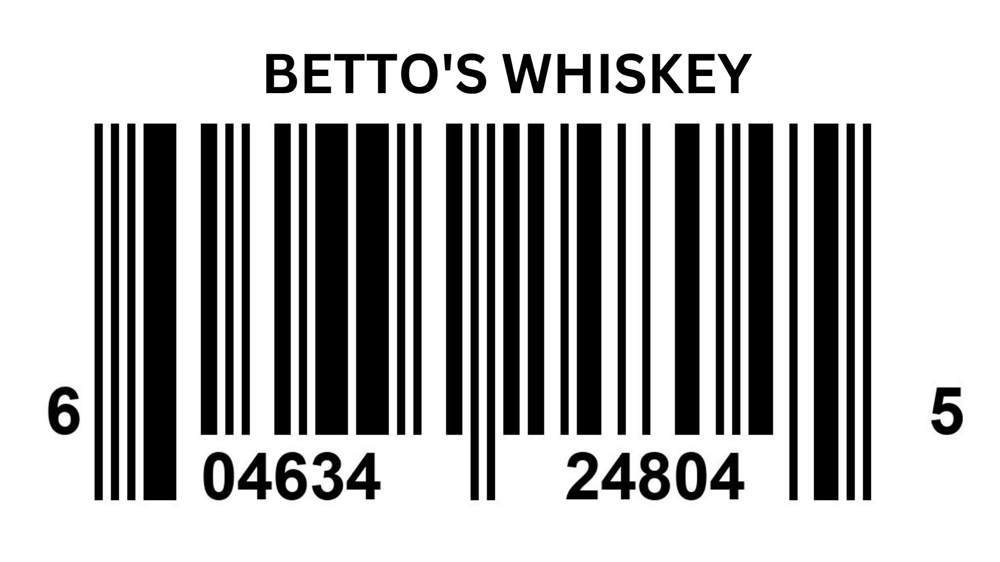
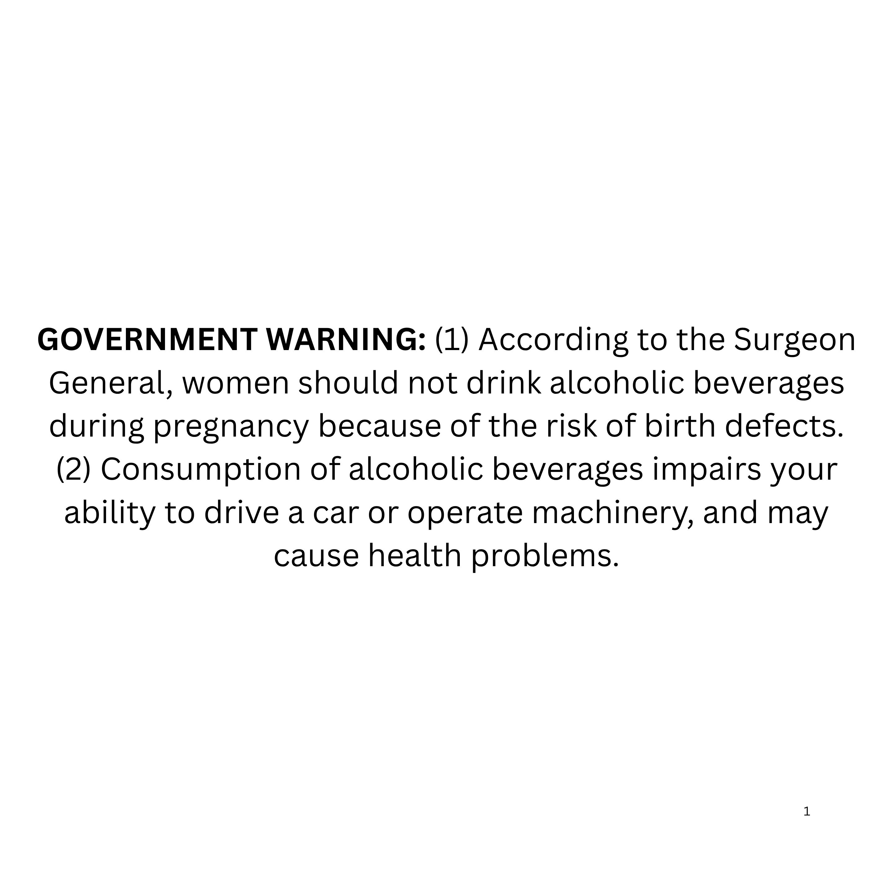

# TTB COLA Label Images - TTBID 26113001000654

**Brand Name:** BETTO'S

**Issue Date:** 05/20/2026

**Origin Code:** 32

**Product Class/Type:** 140

**Source:** [TTB Public COLA Registry](https://ttbonline.gov/colasonline/viewColaDetails.do?action=publicFormDisplay&ttbid=26113001000654)

## Label Images

### Front Label

### Label 2

### Label 3

## Extracted Label Text

*Text extracted via OCR - may contain errors*

*1 image(s) excluded: text did not meet readability threshold*

**Detected Proof:** 80

### Front Label

BETTOS WHISKEY
750
ML 80 PROOF 40% ALCIVOL
Bottled
NLV Tequila Bottling; North Las
Vegas, NV
By,

### Label 3

GOVERNMENT WARNING: (1) According to the Surgeon

General, women should not drink alcoholic beverages

during pregnancy because of the risk of birth defects

(2) Consumption of alcoholic beverages impairs your

ability to drive a car or operate machinery, and may

cause health problems.
