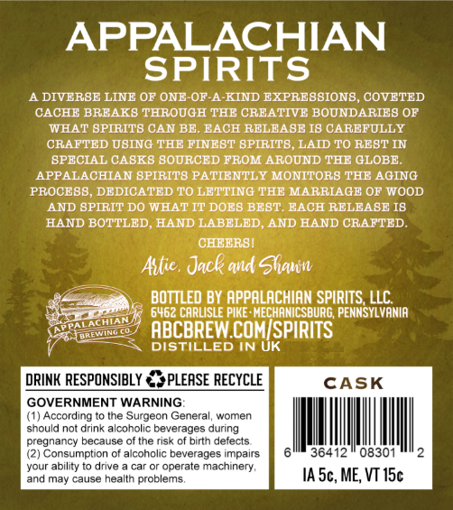
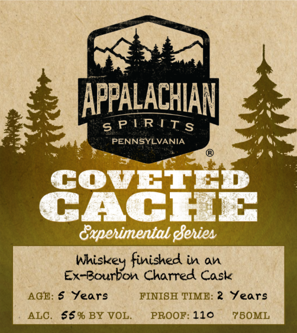

# TTB COLA Label Images - TTBID 26113001000665

**Brand Name:** APPALACHIAN SPIRITS

**Fanciful Name:** COVETED CACHE

**Issue Date:** 04/27/2026

**Origin Code:** 39

**Product Class/Type:** 140

**Source:** [TTB Public COLA Registry](https://ttbonline.gov/colasonline/viewColaDetails.do?action=publicFormDisplay&ttbid=26113001000665)

## Label Images

### Back Label

### Front Label

## Extracted Label Text

*Text extracted via OCR - may contain errors*

**Detected Proof:** 110

### Back Label

APPALACHIAN
SPIRITS
A DIVERBE LINE OF ONE-OF-A-KIND EXPREBBIONB
COVETED
CACHE BRFAK8 THROUGH THE CRBATIVE BOUNDARIEB OF
WHAT BPIRIT8 CAN BE. BACH RELEABE I8 CAREFULLY
CRAFTED UBING THE FINEBT BPIRITB, LAID TO REBT IN
BPECIAL CABK8 BOURCED FROM AROUND THE GLOBE
APPALACHIAN SPIRITS PATIENTLY MONITORS THE AGING
PROCEBB, DEDICATED T0 LETTING THE MARRIAGF OF WOOD
AND BPIRIT DO WHAT IT DOEB BEBT EACH RELEABE I8
HAND BOTTLED
HAND LABELED
AND HAND CRAFTED_
CHEER8I
Attie; Jack and Glqun
BOTTLED BY APPALACHIAN SPIRITS; LLC
6462 CARLISLE PIKE : MECHANICSBURG; PENNSYLVANIA
ABCBREW COMISPIRITS
DISTILLED IN UK
DRINK RESPONSIBLY
PLEASE RECYCLE
CASK
GOVERNMENT WARNING
(1) According to the Surgeon General
women
should not drink alcoholic beverages during
pregnancy because of the risk of birth defects
(2) Consumption
alcoholic beverages impairs
36412
08301
your ability t0 drive
operate machinery,
and may cause health problems
IA Sc, ME; VT 15c
PDALACMIAN
LLIMI

### Front Label

APPALACHIAN
s P TRTT S
PENNSYLVANIA
GGYEFER
Gxpehimental gehien
whiskey finished in an
Ex-Bourbon Charred Cask
AGB: $
fears
FINISH TIMB: 2
Jears
ALC
5S% BY VOL
PROOF: 110
75OML
