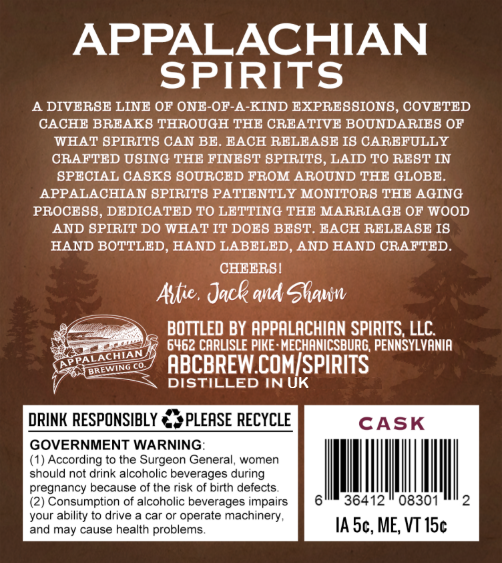
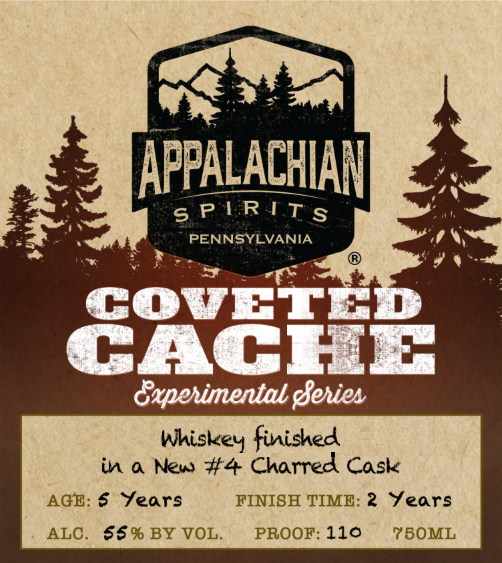

# TTB COLA Label Images - TTBID 26113001000688

**Brand Name:** APPALACHIAN SPIRITS

**Fanciful Name:** COVETED CACHE

**Issue Date:** 04/27/2026

**Origin Code:** 39

**Product Class/Type:** 140

**Source:** [TTB Public COLA Registry](https://ttbonline.gov/colasonline/viewColaDetails.do?action=publicFormDisplay&ttbid=26113001000688)

## Label Images

### Back Label

### Front Label

## Extracted Label Text

*Text extracted via OCR - may contain errors*

**Detected Proof:** 110
**Detected Age:** 2 Years

### Back Label

APPALACHIAN
SPIRITS
A DIVERBE LINE OF ONE-OF-A-KIND EXPREBBION8, COVETED
CACHE BRFAK8 THROUGH THE CREATIVE BOUNDARIEB OP
WEAT BPIRIT8 CAN BE
BACH RELEABE I8 CAREFULLY
CRAFTED UBING THE FINEBT BPIRIT8, LAID TO REBT IN
BPECIAL CABK8 BOURCED FROM AROUND THE GLOBE_
APPALACHIAN BPIRIT8 PATIENTLY MONITOR8 THE AGING
PROCEBB
DEDICATED TO LE TTING THE MARRIAGE OF WOOD
AND BPIRIT DO WHAT IT DOE8 BEBT. EACH RELEABE I8
HAND BOTTLED, HAND LABELED
AND HAND CRAFTED_
CHEERBI
Attie . Jack and Slaln
BOTTLED BY APPALACHIAN SPIRITS LLC
6462 CARLISLE PIKE : MECHANICSBURG, PENNSYLVANIA
ABCBREW COMISPIRITS
DISTILLED IN UK
DRINK RESPONSIBLY
PLEASE RECYCLE
CASK
GOVERNMENT WARNING
(1) According
Ine
Surgeon General
women
should not drink alcoholic beverages during
pregnancy because of the risk of birth defects
(2) Consumption of alcoholic beverages impairs
36412
08301
your ability to drive
car Or
operate machinery,
and may cause health problems
IA 5c, ME; VT 15c
PALATTIAN
IAWIIO

### Front Label

APPALACHIAN

TaN

6s PERITs

Vs

PENNSYLVANIA

aw

9%

se

CovET

CACHE

Experimental Series

Whiskey finished

in a New #4 Charred Cask

AGE: $§ Years

FINISH TIME: 2 Years

ALC. $§% BY VOL.

PROOF: 110

75OML
