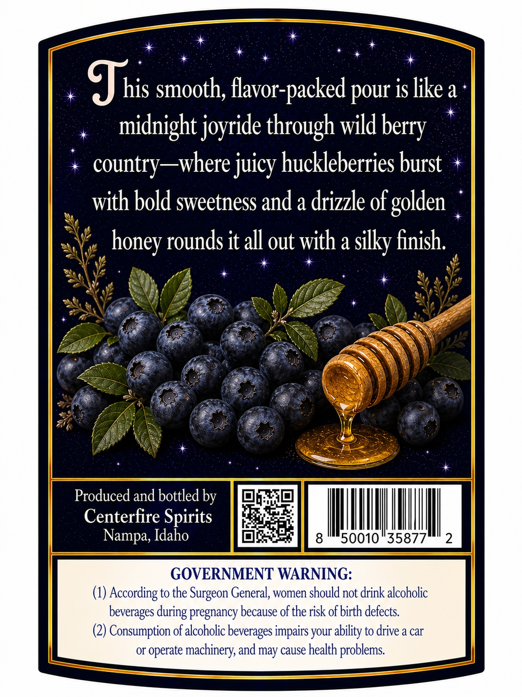
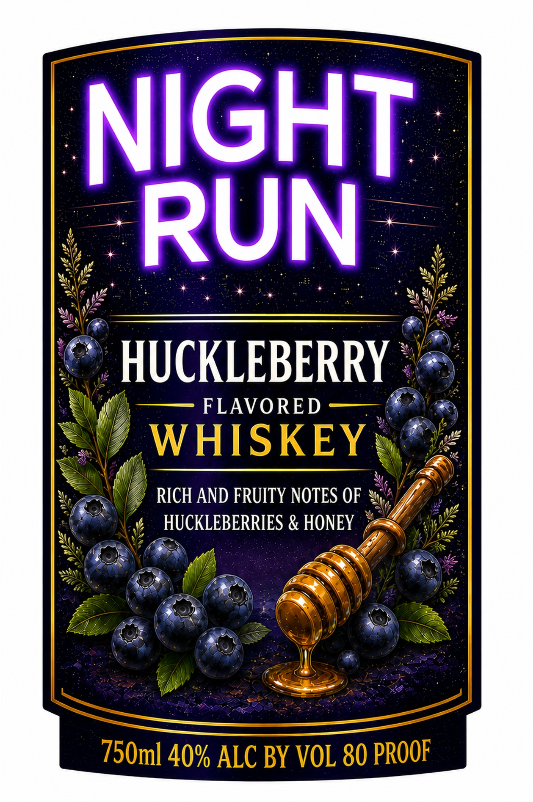

# TTB COLA Label Images - TTBID 26113001000818

**Brand Name:** NIGHT RUN

**Fanciful Name:** HUCKLEBERRY FLAVORED WHISKEY

**Issue Date:** 05/05/2026

**Origin Code:** 18

**Product Class/Type:** 149

**Source:** [TTB Public COLA Registry](https://ttbonline.gov/colasonline/viewColaDetails.do?action=publicFormDisplay&ttbid=26113001000818)

## Label Images

### Back Label

### Front Label

## Extracted Label Text

*Text extracted via OCR - may contain errors*

**Detected Proof:** 80

### Back Label

Jhis smooth; flavor-packed pour is likea
midnight joyride through wild
country _where juicy huckleberries burst
with bold sweetness and a drizzle of
rounds it all out with a silky finish
Produced and bottled by
Centerfire Spirits
Nampa, Idaho
8
50010"35877
2
GOVERNMENT WARNING:
According to the Surgeon General, women should not drink alcoholic
beverages
pregnancy because of the risk of birth defects
(2) Consumption of alcoholic beverages impairs your ability to drive a car
or
operate machinery, and may cause health problems
berry
golden
honey
during

### Front Label

NIGHT
RUN
HUCKLEBERRY
FLAVORED
WHISKEY
RICH AND FRUITY NOTES OF
HUCKLEBERRIES & HONEY
750m] 40% ALC BY VOL 80 PROOF
