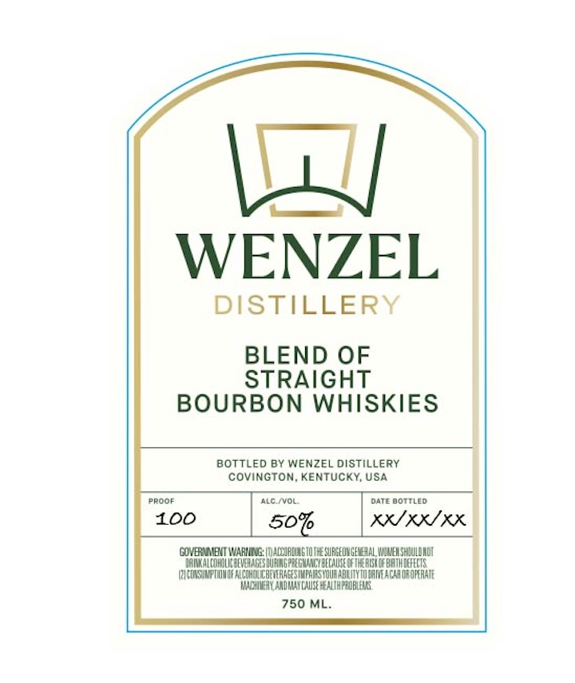

# TTB COLA Label Images - TTBID 26113001000965

**Brand Name:** WENZEL DISTILLERY

**Issue Date:** 04/27/2026

**Origin Code:** 22

**Product Class/Type:** 121

**Source:** [TTB Public COLA Registry](https://ttbonline.gov/colasonline/viewColaDetails.do?action=publicFormDisplay&ttbid=26113001000965)

## Label Images

### Back Label

## Extracted Label Text

*Text extracted via OCR - may contain errors*

### Back Label

DISTILLERY |
BLEND OF
STRAIGHT

BOURBON WHISKIES

BOTTLED BY WENZEL DISTILLERY j

COVINGTON, KENTUCKY, USA \

KAIRIE
‘GOVERNMENT WARING: |1)ACOURDING 10 THE SURGEON GENERAL WOMEN SHIULENOT
‘BRINK ALCOMOLIC BEVERAGES BURING PREGMANCY BECALISE GF THE RISK OF BATH EFECTS.
‘RYCORSHMPTION OF ALCOMOUC BEVERAGES IMPAIRS YOUBABLITY TOGRIEACAR DROPERATE
WADHIMERY AADMAY CASE HEALTH PROBLEM
750 ML.
