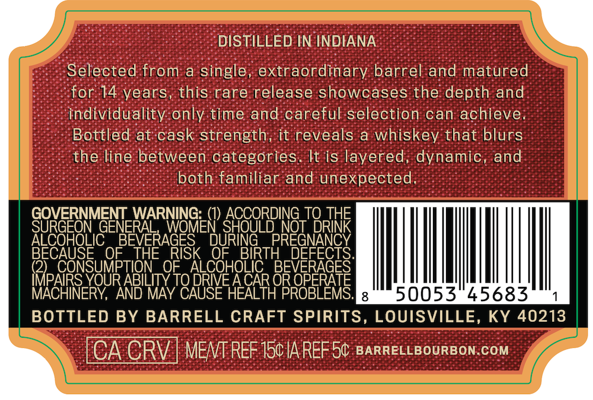
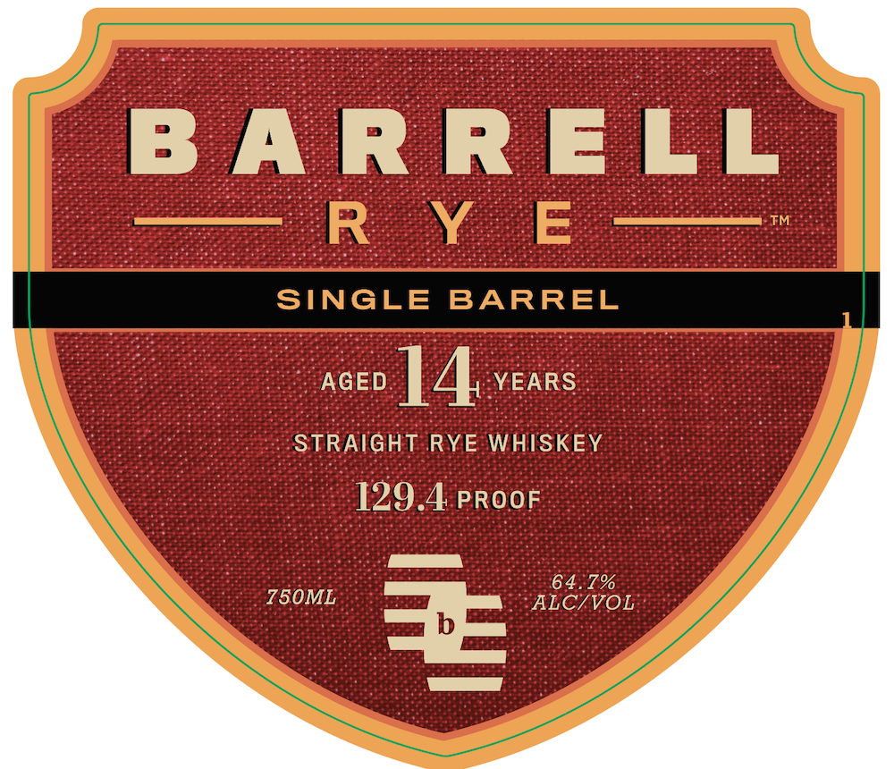
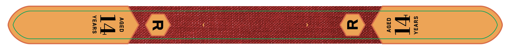

# TTB COLA Label Images - TTBID 26114001000045

**Brand Name:** BARRELL RYE

**Issue Date:** 04/27/2026

**Origin Code:** 22

**Product Class/Type:** 102

**Source:** [TTB Public COLA Registry](https://ttbonline.gov/colasonline/viewColaDetails.do?action=publicFormDisplay&ttbid=26114001000045)

## Label Images

### Back Label

### Front Label

### Label 3

## Extracted Label Text

*Text extracted via OCR - may contain errors*

*1 image(s) excluded: text did not meet readability threshold*

**Detected Proof:** 129.4
**Detected Age:** 14 Years

### Back Label

DISTILLED IN INDIANA
Selected from a single, extraordinary barrel and matured
for 14 vears, this rare release showcases the depth and
individuality only time and careful selection can achieve.
Bottled at cask strength; it reveals
whiskey that blurs
the line between categories. It is layered; dynamic, and
both familiar and unexpected;
GOVERNMENT_WARNING:
ACCORDING_TQ THE
Sue8F8LG)
GENERAL
WOMEN SHOULD NOT DRINK
BEVERAGES
DURING
PREGNANCY
BECAUSE
OF
THE
RISK
OF
BIRTH
'BeveFEGEST
RRIPARS.SOURIBLTOFo DRCQHOCAR
YOUR ABILITY TO DRIVE ACAR OR OPERATE
MACHINERY, AND MAY CAUSE HEALTH PROBLEMS:
50053"45683
BOTTLED BY BARRELL CRAFT SPIRITS, LOUISVILLE, KY 40213
CA CRV ] MENT REF 15cIA REF5C BARRELLBOURBON.COM

### Front Label

B ARR ELL
~ R Y E
TM
SINGLE
BARREL
AGED
14
YEARS
STRAIGHT RYE WHISKEY
129.4 PROOF
64.7%
750ML
ALC/VOL
=
