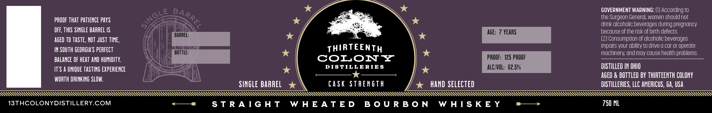

# TTB COLA Label Images - TTBID 26114001000082

**Brand Name:** THIRTEENTH COLONY DISTILLERIES

**Fanciful Name:** WHEATED SINGLE BARREL

**Issue Date:** 04/27/2026

**Origin Code:** 08

**Product Class/Type:** 101

**Source:** [TTB Public COLA Registry](https://ttbonline.gov/colasonline/viewColaDetails.do?action=publicFormDisplay&ttbid=26114001000082)

## Label Images

### Label 1

### Label 2

## Extracted Label Text

*Text extracted via OCR - may contain errors*

**Detected Proof:** 125
**Detected Age:** 7 Years

### Label 1

GOVERNMENT WARNING: (1) According to
the Surgeon General; women should not
PROOF that PATIENCE Pays
drink alcoholic beverages during pregnancv
OFE, THIS SINGLE BARREL IS
IH
aGe: 7 YEARS
because of the risk of birth defects
BARREL:
aged TO TASTE, NOT JUST TIME,
(2) Consumption of dlcoholic beverages
THIRTEENTH
impairs your dbility to drive d car or operate
IN SOuTH GEORGIA S peRFECT
BOTTLe:
machinery; andmay cause hedlth problems
BALANCe OF heat AND HUMIDITY:
CoLONY
PROOF:   125 PROOF
IT'S A UNIQUE TASTING EXPERIENCE
DIS TILLERIE S
ALCIVOL:   62.5%
DISTILLeD IN OHIO
AGED & BOTTLED BY THIRTEENTH COLONY
WORTH DRINKING SLOW:
singLe BarREL
cask STRENGTH
HAnd selected
dlStILLeRIES, LLC AMERICUS, Ga, USA
13THCOLONYDISTILLERYCOM
S T RA IG H T
W HEATED
B 0 U R B 0 N
W HTS KE Y
750 ML
SINGLE
BARREL

### Label 2

PSS SSS SSS SS SS
THIRTEENTH

ye CASK STRENGTH %& conomy CASK STRENGTH &

DISTILLERIES
UYU LLL LL LLM hhh hhh hhh hhh hh hi hh hhh hhh hhh hhh th hhh hhh hh hhh hh hh hhh hh hh hhh hh hh hhh hh hhh hhh hhh hh hh hh ih th hh hh hh hhh hh hh hhh hhh hh tt
