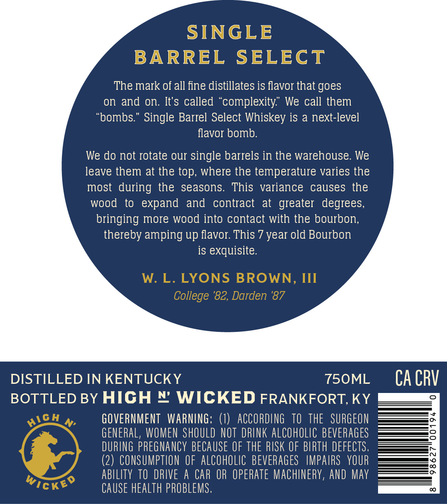
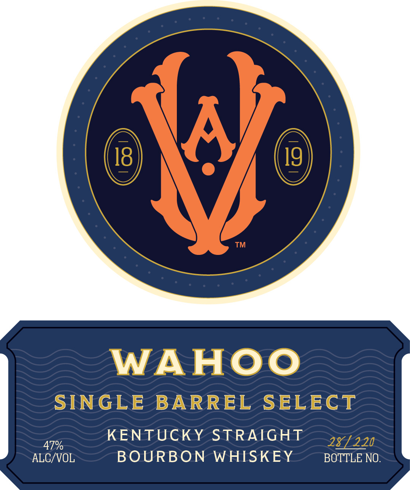

# TTB COLA Label Images - TTBID 26114001000157

**Brand Name:** WAHOO

**Issue Date:** 04/28/2026

**Origin Code:** 22

**Product Class/Type:** 101

**Source:** [TTB Public COLA Registry](https://ttbonline.gov/colasonline/viewColaDetails.do?action=publicFormDisplay&ttbid=26114001000157)

## Label Images

### Back Label

### Front Label

### Label 2

## Extracted Label Text

*Text extracted via OCR - may contain errors*

*1 image(s) excluded: text did not meet readability threshold*

**Detected Age:** 7 Years

### Back Label

SINGLE
BARREL
SELECT
The mark of all fine distillates is flavor that goes
on and on. It's called
'complexity" We call them
'bombs " Single Barrel Select Whiskey is a next-level
flavor bomb:
We do not rotate our single barrels in the warehouse: We
leave them at the top; where the temperature varies the
most during the
seasons:
This   variance
causes the
wood
to
expand
and
contract
at
greater  degrees;
bringing more wood into contact with the bourbon;
thereby amping up flavor This 7 year old Bourbon
is exquisite:
W: L. LYONS BROWN, III
College '82, Darden '87
DISTILLED IN KENTUCKY
750ML
CA CRV
BOTTLED BY HICH N WICKED FRANKFORT,KY

GOVERNMENT   WARNING: ()  ACCORDING   TO  thE   SURGEON
GENERAL, WOMEN ShOULD NOT DRLNK alCoholic BEVERaGes
DURING pReGNAnCY BECAUSE OF ThE RISK OF BIRTH DEFECTS ,
(2) CONSUMPTION €F AlCohOLIc BEVERAGes  IMPAIRS   YOUR
abllity TO DRIVE
A CAR OR operate MAChINERV, ANd May
Wickeo
CAUSE health PROBLeMS,
HICH

### Front Label

WAHOO

SINGLE BARREL SELECT

is KENTUCKY STRAIGHT
ALG/VOL BOURBON WHISKEY BOTTLE NO.
