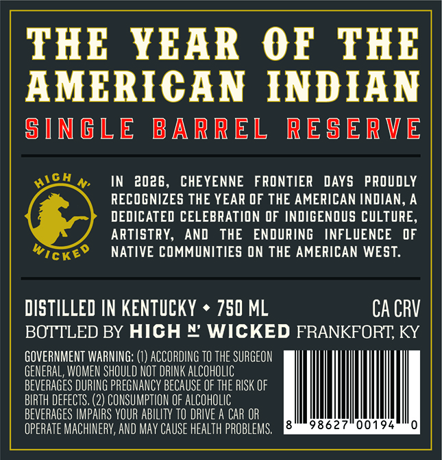
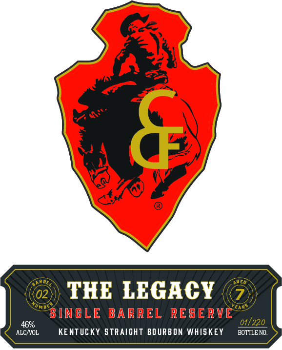
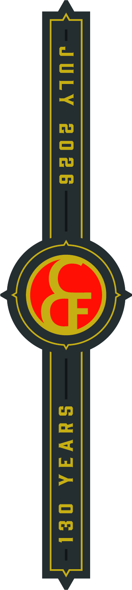

# TTB COLA Label Images - TTBID 26114001000173

**Brand Name:** THE LEGACY

**Issue Date:** 04/28/2026

**Origin Code:** 22

**Product Class/Type:** 101

**Source:** [TTB Public COLA Registry](https://ttbonline.gov/colasonline/viewColaDetails.do?action=publicFormDisplay&ttbid=26114001000173)

## Label Images

### Back Label

### Front Label

### Label 3

## Extracted Label Text

*Text extracted via OCR - may contain errors*

*1 image(s) excluded: text did not meet readability threshold*

### Back Label

THE
YEAR
0F
THE
AMERICAN INDIAN
siNGLE
BARREL
RESERVE
IN
2026 ,
CHEYENNE
FRONTIER
DAYS
PROUDLY
RECOGNIZES THE YEAR OF THE AMERICAN INDIAN, A
DEDICATED CELEBRATION OF INDIGENOUS CULTURE,
ARTISTRY,
AND
THE
ENDURING
INFLUENCE
DF
Wickeo
NATIVE COMMUNITIES ON THE AMERICAN WEST:
DISTILLED IN KENTUCKY
750 ML
CA CRV
BOTTLED BY HICH % WICKED FRANKFORT; KY
GOVERNMENT WARNING; () ACCORDING TO THE SURGEON
GENERAL, WOMEN SHOULD NOT DRINK aLCOHOLIC
beveRAGES DURING PREGNANCY BECAUSE OF THE RISK OF
BIRTH DEfECTS, (2) CONSUMPTION OF ALCOHOLIC
beveRAGES IMPAIRS YOUR ABILITY tO dRIVE A CAR OR
OpERAte MACHINERY; AND May CAUSE HEalTh PROBLEMS;
98627
00194
HicH

### Front Label

02
THE LEGACY
S I NGLE BARREL
RESERVE
46%6
01/220
ALC VOL
KENTUCKY STRAIGHT BO URBON WHISKEY
BOTTLE NO:
