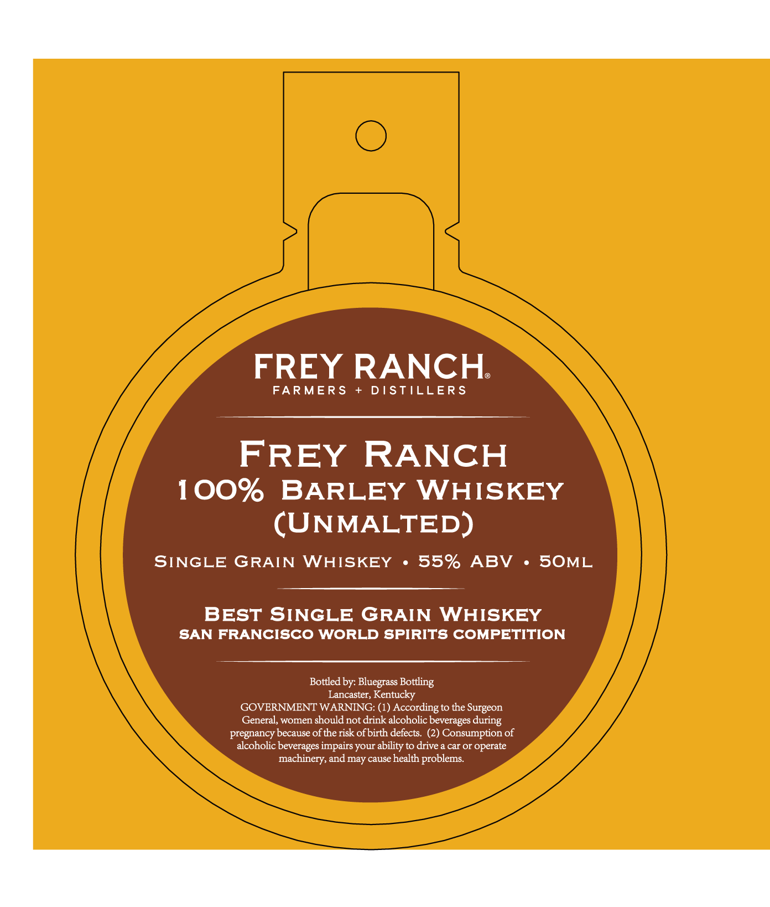
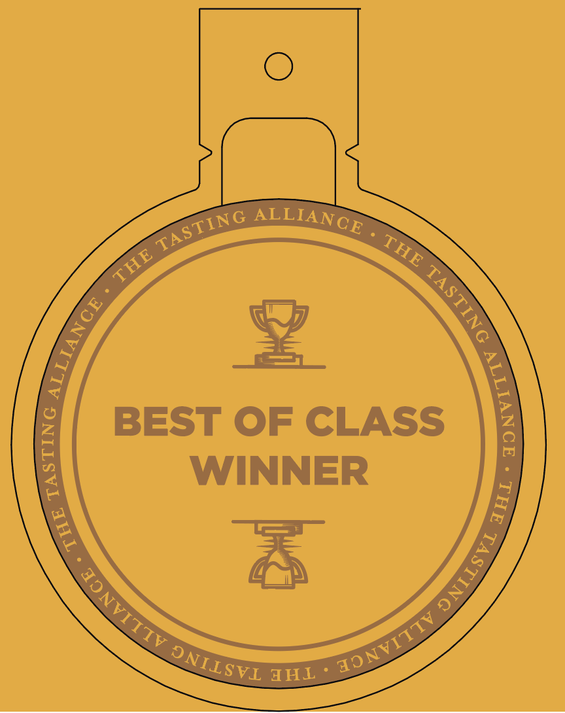

# TTB COLA Label Images - TTBID 26114001000299

**Brand Name:** FREY RANCH

**Issue Date:** 04/29/2026

**Origin Code:** 22

**Product Class/Type:** 140

**Source:** [TTB Public COLA Registry](https://ttbonline.gov/colasonline/viewColaDetails.do?action=publicFormDisplay&ttbid=26114001000299)

## Label Images

### Label 1

### Label 2

## Extracted Label Text

*Text extracted via OCR - may contain errors*

**Detected Proof:** 110

### Label 1

FREY RANCH
FARMERS
DSTILLER S
FREY
RANCH
100%
BARLEY
WHISKEY
(UNMALTED)
SINGLE
GRAIN
WHISKEY
55%
ABV
SOML
BEST SINGLE GRAIN WHISKEY
SAN FRANCISCO WORLD SPIRITS COMPETITION
Bottled by: Bluegrass Bottling
Lancaster, Kentucky
GOVERNMENT WARNING: (1) According to the Surgeon
General, women should not drink alcoholic beverages
pregnancy because of the risk ofbirth defects:
Consumption of
alcoholic beverages impairs your ability to drive a car or operate
machinery, and may cause health problems:
during

### Label 2

BEST OF CLASS
1
WINNER
TAI '
ALLIANCE
TASTING
THE
THE
1
1
1
1
1
1
JONVITIV _
JONVITTV_
DNILSVI _
