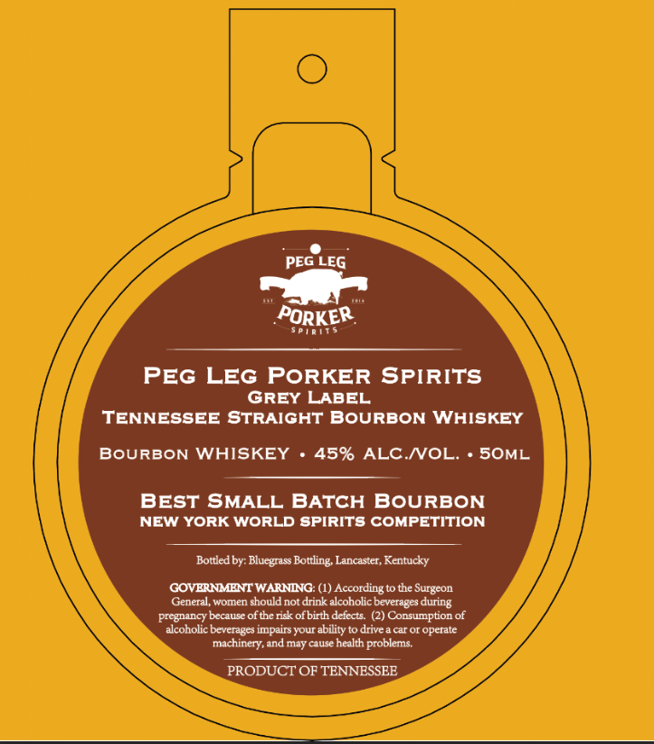

# TTB COLA Label Images - TTBID 26114001000304

**Brand Name:** PEG LEG PORKER

**Issue Date:** 05/13/2026

**Origin Code:** 22

**Product Class/Type:** 101

**Source:** [TTB Public COLA Registry](https://ttbonline.gov/colasonline/viewColaDetails.do?action=publicFormDisplay&ttbid=26114001000304)

## Label Images

### Label 1

### Label 2

## Extracted Label Text

*Text extracted via OCR - may contain errors*

**Detected Proof:** 90

### Label 1

PEG LEG
PORKER
PEG LEG PORKER SPIRITS
GREY LABEL
TENNESSEE STRAIGHT BOURBON WHISKEY
BOURBON WHISKEY
45% ALC NOL
SOML
BEST SMALL BATCH
BoURBON
NEW YORK WorLD spiRITS COMPETITION
Bottled by: Blucgrass Bottling Lancaster, Kentucky
GOVERNMENT WARNENG: (1) According to the Surgeon
General, women should not drink alcoholic beverages during
pregnancy because of the risk ofbirth defects  (2) Consumption of
alcoholic beverages impairs your ability t0 drive a car O1 operate
Ichinery,
may cause health
problems
PRODUCT OF TENNESSEE
S01
and

### Label 2

BEST OF CLASS
1
WINNER
TAI '
ALLIANCE
TASTING
THE
THE
1
1
1
1
1
1
JONVITIV _
JONVITTV_
DNILSVI _
