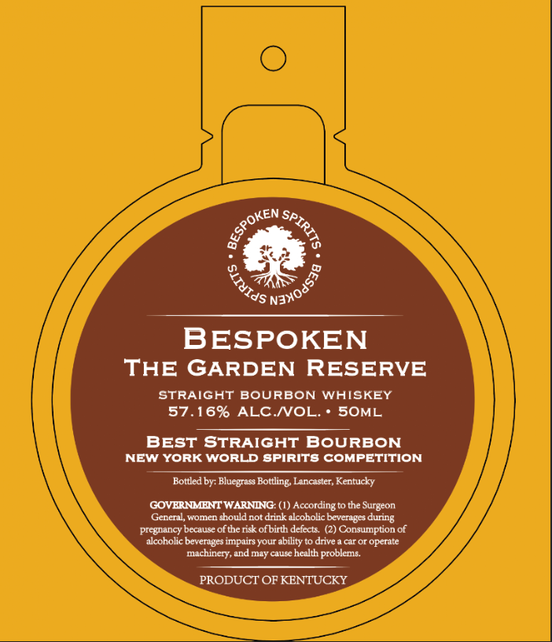

# TTB COLA Label Images - TTBID 26114001000307

**Brand Name:** BESPOKEN

**Issue Date:** 05/01/2026

**Origin Code:** 22

**Product Class/Type:** 101

**Source:** [TTB Public COLA Registry](https://ttbonline.gov/colasonline/viewColaDetails.do?action=publicFormDisplay&ttbid=26114001000307)

## Label Images

### Label 1

### Label 2

## Extracted Label Text

*Text extracted via OCR - may contain errors*

**Detected Proof:** 114.3

### Label 1

BESPOKEN
THE GARDEN RESERVE
STRAIGHT BOURBON WHISKEY
57.16% ALC NVOL.
SOML
BEST STRAIGHT BOURBON
NEW YORK
WorLD spirits COMPETITION
Bottled by: Bluegrass Bottling Lancaster, Kentucky
GOVERNMENT WARNING: (I) According to the Surgeon
General, women should not drink alcoholic beverages during
pregnancy because of the risk ofbirth defects
(2) Consumption of
alcoholic beverages impairs your ability to drive
caror
operate
machincry, and may causc health problems
PRODUCT OF KENTUCKY
QeSPoKen_
SPIRITS
'Naxoass8
SITUIds

### Label 2

BEST OF CLASS
1
WINNER
TAI '
ALLIANCE
TASTING
THE
THE
1
1
1
1
1
1
JONVITIV _
JONVITTV_
DNILSVI _
