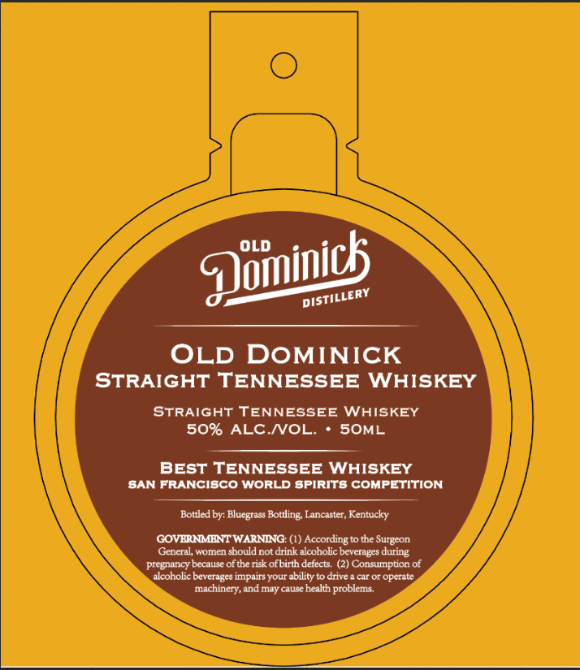

# TTB COLA Label Images - TTBID 26114001000373

**Brand Name:** OLD DOMINICK

**Issue Date:** 05/01/2026

**Origin Code:** 22

**Product Class/Type:** 140

**Source:** [TTB Public COLA Registry](https://ttbonline.gov/colasonline/viewColaDetails.do?action=publicFormDisplay&ttbid=26114001000373)

## Label Images

### Label 1

### Label 2

## Extracted Label Text

*Text extracted via OCR - may contain errors*

**Detected Proof:** 100

### Label 1

OLD DOMINICK
STRAIGHT TENNESSEE
WHISKEY
STRAIGHT TENNESSEE
WHISKEY
50% ALC NOL:
SOML
BEST TENNESSEE WHISKEY
BAN FRANCISCO WorLD spirITS COMPETITION
Botted by: Bluegrass Bottling Lancaster, Kentucky
GOVERHMMHNT WARNING: (1)
According '
to the Surgeon
General, women chouldnot drink alcoholic beverages during
pregnancy because ofthe risk ofbirth defects
(2) Consumption of
alcoholic bevcrages impairs your ability to drive
cr or opcrate
machinery, and may
causy
health
problems:
Quiinics
DISTILLERY

### Label 2

BEST OF CLASS
1
WINNER
TAI '
ALLIANCE
TASTING
THE
THE
1
1
1
1
1
1
JONVITIV _
JONVITTV_
DNILSVI _
