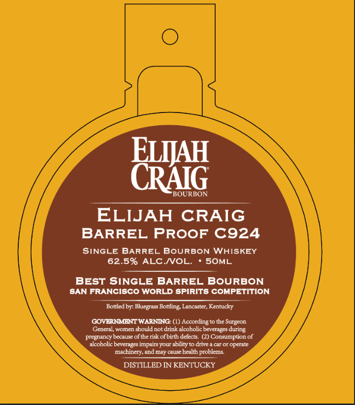

# TTB COLA Label Images - TTBID 26114001000481

**Brand Name:** ELIJAH CRAIG

**Issue Date:** 05/14/2026

**Origin Code:** 22

**Product Class/Type:** 141

**Source:** [TTB Public COLA Registry](https://ttbonline.gov/colasonline/viewColaDetails.do?action=publicFormDisplay&ttbid=26114001000481)

## Label Images

### Front Label

### Label 2

## Extracted Label Text

*Text extracted via OCR - may contain errors*

**Detected Proof:** 125

### Front Label

ELIJAH
CRAIG
BOURBON
ELIJAH
CRAIG
BARREL PROOF C924
SINGLE BARREL
BOURBON WHISKEY
62.5% ALC NOL.
SOML
BEST SINGLE BARREL BOURBON
SAN FRANCISCO WORLD spirITs COMPETITION
Bottled by: Bluegrass Bottling Lancaster, Kentucly
GOVBRNMENT WARNING: (1) According to the Surgeon
General, women should not drink alcoholic beverages during
pregnancy because ofthe risk ofbirth defects.
(2) Consumption of
akcoholic beverages impairs your abilityto drive a car or operate
machinery,and may causehealth problems
DISTILLED IN KENTUCKY

### Label 2

BEST OF CLASS
1
WINNER
TAI '
ALLIANCE
TASTING
THE
THE
1
1
1
1
1
1
JONVITIV _
JONVITTV_
DNILSVI _
