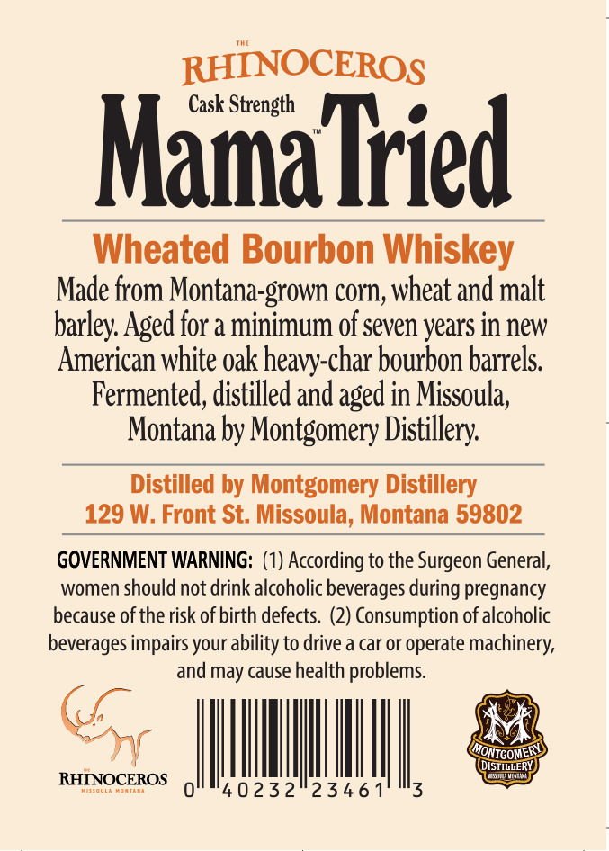
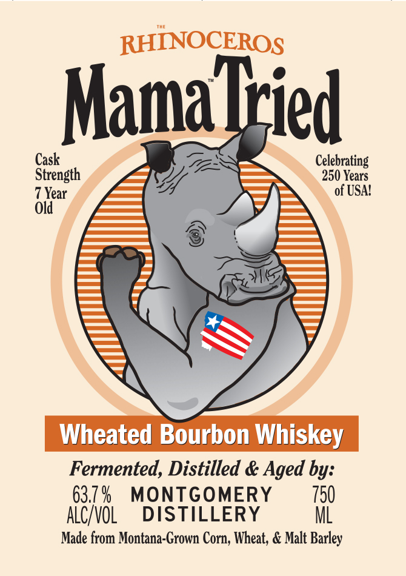

# TTB COLA Label Images - TTBID 26114001000548

**Brand Name:** MAMA TRIED

**Fanciful Name:** THE RHINOCEROS

**Issue Date:** 04/28/2026

**Origin Code:** 30

**Product Class/Type:** 141

**Source:** [TTB Public COLA Registry](https://ttbonline.gov/colasonline/viewColaDetails.do?action=publicFormDisplay&ttbid=26114001000548)

## Label Images

### Back Label

### Front Label

## Extracted Label Text

*Text extracted via OCR - may contain errors*

**Detected Proof:** 127.4
**Detected Age:** 7 Years

### Back Label

RHINOCEROS
Mamalied
Wheated Bourbon Whiskey
Made from Montana-grown corn, wheat and malt
barley Aged for a minimum of seven years in new
American white oak heavy-char bourbon barrels
Fermented; distilled and aged in Missoula;
Montana by Montgomery Distillery
Distilled by Montgomery Distillery
129 W: Front St: Missoula, Montana 59802
GOVERNMENT WARNING: (1) According to the Surgeon General,
women should not drink alcoholic beverages
pregnancy
because of the risk of birth defects  (2) Consumption of alcoholic
beverages impairs your ability to drive a car or operate machinery,
and
cause health problems;
MONTGOMERY
DISTILLERY
WrintttL
RHINOCEROS
40232"2346 1
3
during
may

### Front Label

RHINOCEROS
Mamattied
Cask
Celebrating
Strength
250 Years
7 Year
of USA!
Old
Wheated Bourbon Whiskey
Fermented, Distilled & Aged by:
63.7 %
MONTGOMERY
750
alcyvol
DISTILLERY
ML
Made from Montana-Grown Corn, Wheat; & Malt Barley
