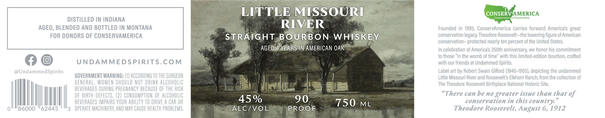
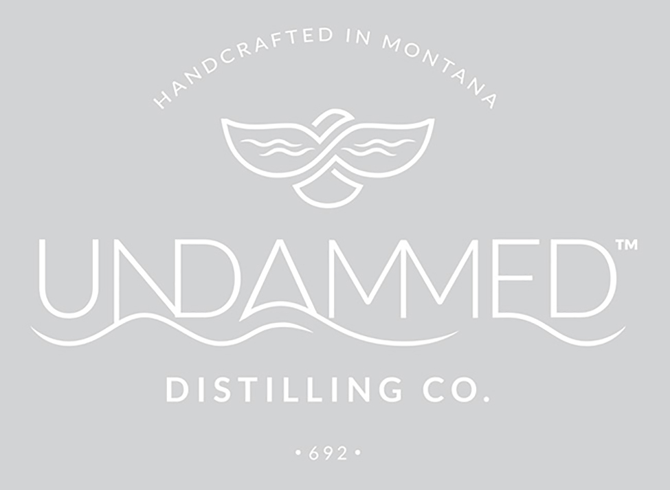

# TTB COLA Label Images - TTBID 26114001000570

**Brand Name:** LITTLE MISSOURI RIVER STRAIGHT BOURBON WHISKEY

**Issue Date:** 04/28/2026

**Origin Code:** 30

**Product Class/Type:** 101

**Source:** [TTB Public COLA Registry](https://ttbonline.gov/colasonline/viewColaDetails.do?action=publicFormDisplay&ttbid=26114001000570)

## Label Images

### Label 1

### Label 2

## Extracted Label Text

*Text extracted via OCR - may contain errors*

*1 image(s) excluded: text did not meet readability threshold*

**Detected Proof:** 90
**Detected Age:** 4 Years

### Label 1

LITTLE MISSOURI
CONSERVAMERICA
Conservation
Conservative
DISTILLED IN INDIANA
AGED, BLENDED AND BOTTLED IN MONTANA
RIVER
Founded in 1995, ConservAmerica carries forward America's great
FOR DONORS OF CONSERVAMERICA
STRAIGHT BOURBON
WHISKEY
conservation legacy Theodore Roosevelt-the towering figure of American
conservation-protected nearly ten percent of the United States;
AGED 4 YEARS IN AMERICAN OAK
In celebration of America's 250th anniversary; we honor his commitment
to those "in the womb of time" with this limited-edition bourbon; crafted
UNDAMMEDSPIRITS.COM
with our friends at Undammed Spirits:
@UndammedSpirits
Label art by Robert Swain Gifford (1840-1905), depicting the undammed
GOVERNMENT WARNING: (€) ACCORDING TO THE SURGEON
Little Missouri River and Roosevelt's Elkhorn Ranch; from the collection of
GENERAL, WOMEN ShOULD NOT DRINK alCoholic
The Theodore Roosevelt Birthplace National Historic Site,
beVeRAGES DURING PREGNANCV BECAuSE OF ThE RISK
OF BRTH  deFECTS, (2)  CONSUMPTION OF AlCOhOLIC
"There can be no greater issue than that of
BEVERAGES IMPAIRS VOUR abILITY TO DRIVE A CAR OR
45%
90
750
ML
conservation in this country
0
86000
62445
3
opeRATE MAChINERV; AND MAv Cause healTh PROBLEMS ,
ALC/VOL
PROOF
Theodore Roosevelt, August 6,1912
