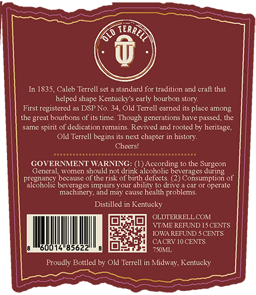
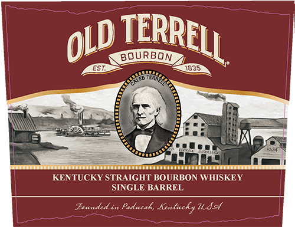
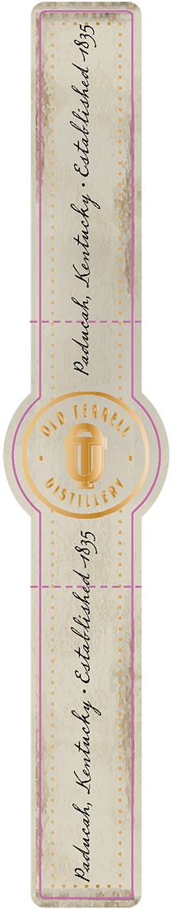
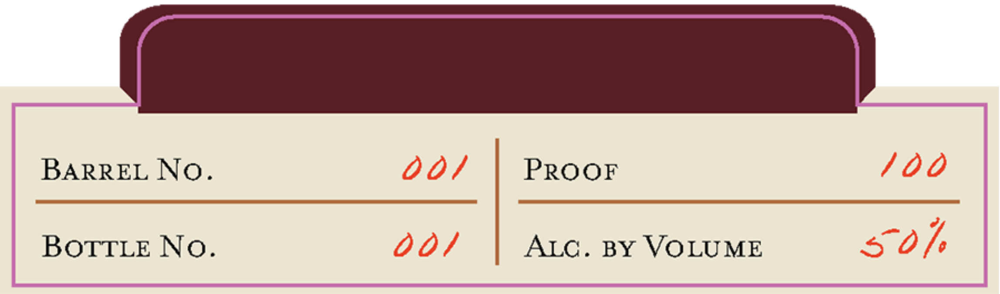

# TTB COLA Label Images - TTBID 26114001000588

**Brand Name:** OLD TERRELL

**Issue Date:** 05/19/2026

**Origin Code:** 22

**Product Class/Type:** 101

**Source:** [TTB Public COLA Registry](https://ttbonline.gov/colasonline/viewColaDetails.do?action=publicFormDisplay&ttbid=26114001000588)

## Label Images

### Back Label

### Front Label

### Label 2

### Label 4

## Extracted Label Text

*Text extracted via OCR - may contain errors*

*2 image(s) excluded: text did not meet readability threshold*

### Back Label

In 1835, Caleb Terrell sct
standard for tradition and craft that
helped shape Kentucky' $ early bourbon story:
First registered as DSP No. 34,Old Terrell earned its place among
the great bourbons of its time. Though generations have passed, the
same spirit of dedication remains. Revived and rooted by heritage,
Old Terrell begins its next chapter in history:
Cheersl
GOVERMMMENT WARNING:
According
the Surgeon
General
women should not drink alcoholic beverages
pregnancy because
the risk of birth defects (2) Consumption of
alcoholic beverages impairs your
ability
drive
Camom
operale
machinery; and may cause health
problems:
Distilled in Kentucky
OLDTERRELL COM
VTMME REIUND ISCENTS
IOWA REFUND
CENTS
CACRV 10 CENTS
600
85622
7SOML
Proudly Bottled by Old Terrell in Midway, Kentucky
RREL
during

### Front Label

BOURBON
1835
KENTUCKY STRAIGHT BOURBON WHISKEY
SINGLE BARREL
Tounded in Paducahy Kentucky USct
TERRELL
OLD
