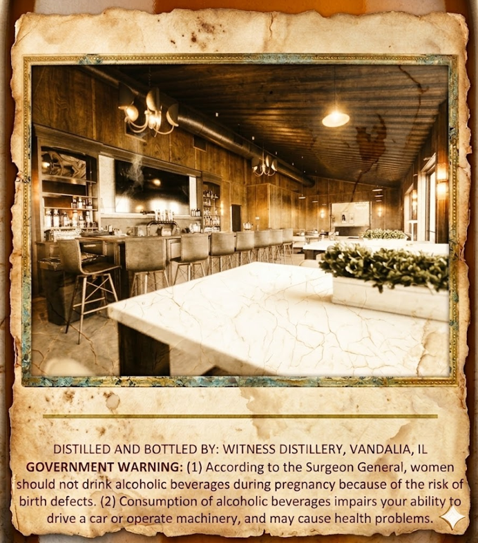
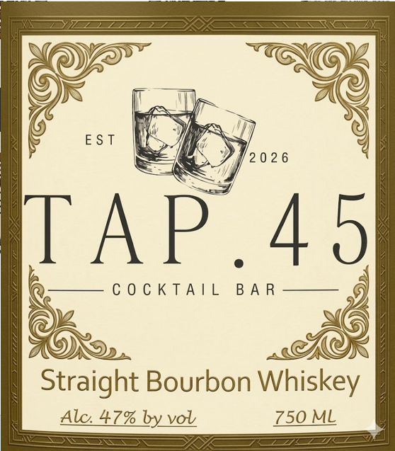

# TTB COLA Label Images - TTBID 26114001000605

**Brand Name:** TAP.45 COCKTAIL BAR

**Issue Date:** 04/28/2026

**Origin Code:** 04

**Product Class/Type:** 101

**Source:** [TTB Public COLA Registry](https://ttbonline.gov/colasonline/viewColaDetails.do?action=publicFormDisplay&ttbid=26114001000605)

## Label Images

### Back Label

### Front Label

## Extracted Label Text

*Text extracted via OCR - may contain errors*

*1 image(s) excluded: text did not meet readability threshold*

### Back Label

DISTILLED AND BOTTLED BY: WITNESS DISTILLERY, VANDALIA, IL
GOVERNMENT WARNING: (1) According to the Surgeon General, women
should not drink alcoholic beverages
pregnancy because of the risk of
birth defects. (2) Consumption of alcoholic beverages impairs your ability to
drive a car or
operate machinery, and may cause health problems_
during
