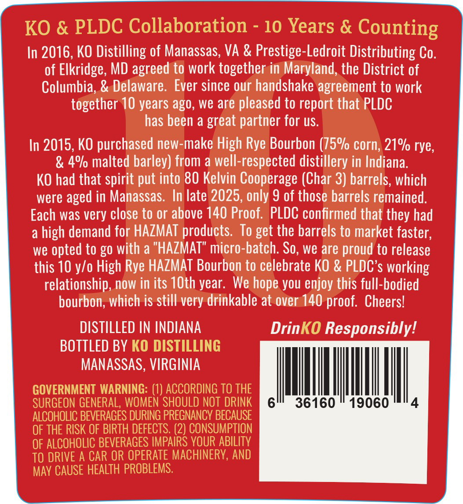
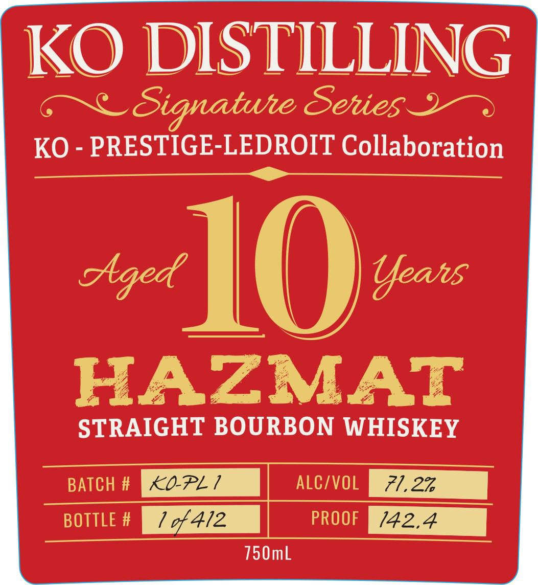
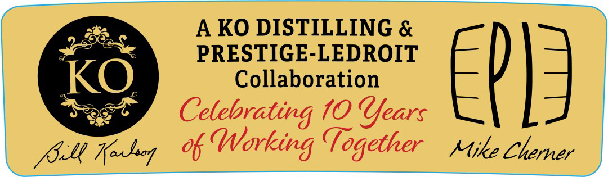
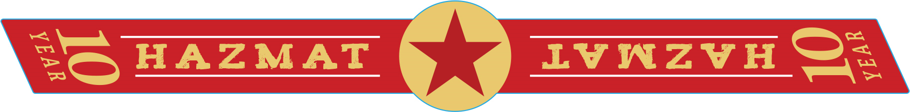

# TTB COLA Label Images - TTBID 26114001000606

**Brand Name:** KO DISTILLING

**Issue Date:** 05/04/2026

**Origin Code:** 05

**Product Class/Type:** 101

**Source:** [TTB Public COLA Registry](https://ttbonline.gov/colasonline/viewColaDetails.do?action=publicFormDisplay&ttbid=26114001000606)

## Label Images

### Back Label

### Label 1

### Label 2

### Label 3

## Extracted Label Text

*Text extracted via OCR - may contain errors*

*1 image(s) excluded: text did not meet readability threshold*

**Detected Proof:** 140
**Detected Age:** 10 Years

### Back Label

KO & PLDC Collaboration
10 Years &
Counting
In 2016, KO Distilling of Manassas; VA & Prestige-Ledroit Distributing Co.
of Elkridge; MD agreed to work together in Maryland, the District of
Columbia; & Delaware: Ever since our handshake agreement to work
together 10 years ago, we are pleased to report that PLDC
has been a great partner for US.
In 2015, KO purchased new-make High Rye Bourbon (75%/ corn; 21% rye;
& 4% malted barley) from a well-respected distillery in Indiana.
KO had that spirit put into 80 Kelvin Cooperage (Char 3) barrels; which
were
in Manassas: In late 2025,only 9 of those barrels remained.
Each was very close to or above 140 Proof.  PLDC confirmed that they had
a
high demand for HAZMAT products.
To get the barrels to market faster,
we
opted to go with a "HAZMAT" micro-batch: So, we are proud to release
this 10 y/o High Rye HAZMAT Bourbon to celebrate KO & PLDC'$ working
relationship, now in its IOth year. We
you enjoy this full-bodied
bourbon;, which is still very drinkable at over 140 proof. Cheersl
DISTILLED IN INDIANA
DrinKO Responsiblyl
BOTTLED BY KO DISTILLING
MANASSAS, VIRGINIA
GOVERNMENT WARNING: (1) ACCORDING TO THE
SURGEON GENERAL, WoMEN SHOULD NOT DRINK
6
36160
19060
4
ALCOHOLIC BEVERAGES DURING PREGNANCV BECAUSE
OF THE RISK OF BIRTH DEFECTS. (2) CONSUMPTION
OF ALCOHOLIC BEVERAGES IMPAIRS VOUR ABILITV
TO DRIVE A CAR OR OPERATE MACHINERV, AND
May CAUSE HEALTH PROBLEMS:
aged
hope

### Label 1

KO DISTILLING
Signatute Sehies
KO - PRESTIGE-LEDROIT Collaboration
cged
10
Ueans
HAZMAT
STRAIGHT BOURBON WHISKEY
BATCH #
KOPL1
ALC/VOL
71.27
BOTTLE #
1 %412
PROOF
142.4
750mL

### Label 2

AKO DISTILLING &

PRESTIGE-LEDROIT

kO

Collaboration

Sey  Celebrati

70 Years

file Kobeg Working Together stile Chemer
