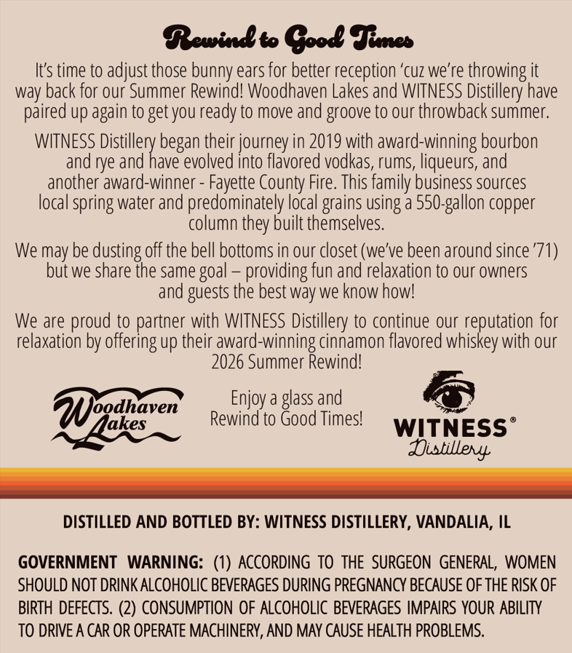

# TTB COLA Label Images - TTBID 26114001000642

**Brand Name:** REWIND TO GOOD TIMES

**Fanciful Name:** WOODHAVEN LAKES 2026 EDITION CINNAMON FLAVORED WHISKEY

**Issue Date:** 04/28/2026

**Origin Code:** 04

**Product Class/Type:** 149

**Source:** [TTB Public COLA Registry](https://ttbonline.gov/colasonline/viewColaDetails.do?action=publicFormDisplay&ttbid=26114001000642)

## Label Images

### Front Label

## Extracted Label Text

*Text extracted via OCR - may contain errors*

### Front Label

Rewinto Oood Fues
It's time to adjust those bunny ears for better reception 'cuz we're throwing it
way back for our Summer Rewind! Woodhaven Lakes and WITNESS Distillery have
paired up again to get you ready to move and groove to our throwback summer:
WITNESS
began their journey in 2019 with award-winning bourbon
andrye and
evolved into flavored vodkas, rums, liqueurs, and
another award-winner - Fayette County Fire. This family business sources
local spring water and predominately local grains using a 550-5
copper
column they built themselves_
We may be
off the bell bottoms in our closet (we've been around since '71)
but we
dhsredo
share
same goal
providing fun and relaxation to our owners
and guests the best way we know howl
We are proud to partner with WITNESS Distillery to continue our reputation for
relaxation by offering up their award-winning cinnamon flavored whiskey with our
2026 Summer Rewindl
Enjoy a glass and
WNoodhaven'
Rewind to Good Timesl
hakes
WITNESS
Dutilleny
DISTILLED AND BOTTLED BY: WITNESS DISTILLERY, VANDALIA, IL
GOVERNMENT WARNING:
According To THE SURGEON GENERAL, WOMEN
SHOULD NOT DrInK ALCOHOLIC BEVERAGES DURING PREGNANCY BECAUSE OF THE RISK OF
BIRTH DEFECTS. (2) CONSUMPTION OF ALCOHOLIc BEVERAGES IMPAIRS YOUR ABILITy
TO DRIVE A CAR OR OPERATE MACHINERY, AND MAY CAUSE HEALTH PROBLEMS.
5 Distlled Rave
~gallon ,
