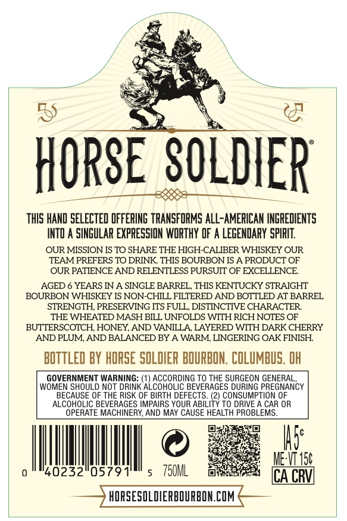
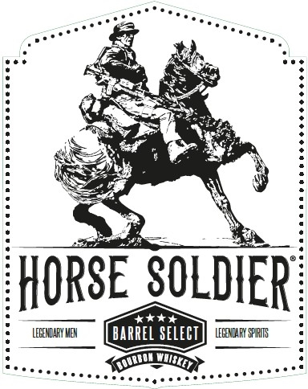
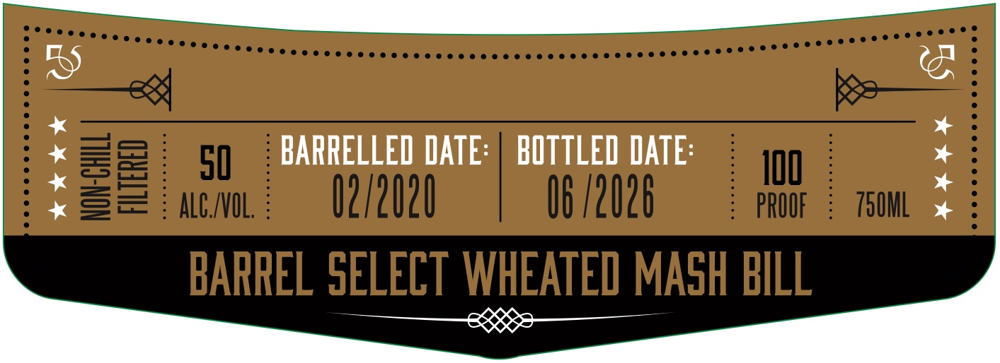
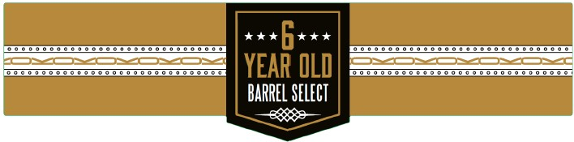

# TTB COLA Label Images - TTBID 26114001000713

**Brand Name:** HORSE SOLDIER

**Issue Date:** 04/28/2026

**Origin Code:** 09

**Product Class/Type:** 141

**Source:** [TTB Public COLA Registry](https://ttbonline.gov/colasonline/viewColaDetails.do?action=publicFormDisplay&ttbid=26114001000713)

## Label Images

### Back Label

### Front Label

### Label 2

### Label 4

## Extracted Label Text

*Text extracted via OCR - may contain errors*

### Back Label

HORSE SOLDIER
ThIS HAND SELECTED OFFERING TRANSFORMS alL-AMERICAN INGREDIENTS
INTO A SINGULAR EXPRESSION WORTHY DF A LeGEndaRY spIRIT
OUR MISSION IS TO SHARE THE HIGH-CALIBER WHISKEY OUR
TEAM PREFERS TO DRINK THIS BOURBON IS A PRODUCT OF
OUR PATIENCE AND RELENTLESS PURSUIT OF EXCELLENCE
AGED
YEARS IN A SINGLE BARREL, THIS KENTUCKY STRAIGHT
BOURBON WHISKEY IS NON-CHILL FILTERED AND BOTTLED AT BARREL
STRENGTH, PRESERVING ITS FULL, DISTINCTIVE CHARACTER
THE WHEATED MASH BILL UNFOLDS WITH RICH NOTES OF
BUTTERSCOTCH, HONEY, AND VANILLA LAYERED WITH DARK CHERRY
AND PLUM, AND BALANCED BY A WARM, LINGERING OAK FINISH
BOTTLED BY HORSE SOLDIER BOURBON, COLUMBuS, OH
GOVERNMENT WARNING:
ACCORDING TO THE SURGEON GENERAL
WOMEN SHOULD NOT DRINK
'ALCOCoEIC BEVERAGES DURENG PREGIANCY
BECAUSE OF THE RISK OF BIRTH DEFECTS. (2) CONSUMPTION OF
ALCOHOLIC BEVERAGES IMPAIRS YOUR ABILI
TO DRIVE
CAR OR
ERATE MACHINERY, AND MAY CAUSE HEALTH PROBLEMS
Is:
MEWIS
40232"05791'
750ML
ICA CRVL
HORSESOLDIERBOURBON.COM

### Front Label

HORSE SOLDIER
#*4+
LEEENDAFY MEX
barrel select
LEGENDAFX BFUHITS

### Label 2

50
BARRELLED ATe:
BOTTLED DATE:
IqQ
82
ALC_INOL;
02/2020
06 /2026
PROOF
750ML
BARREL SELECT WHEATED MASH BILL

### Label 4

SESE STTOSTTOSTSSSTOSTTOSET

ea ee

SETTOSTTOTTSOTTTS TSO STSSSTOSTT

YEAR OL0

BARREL SELECT

ee
