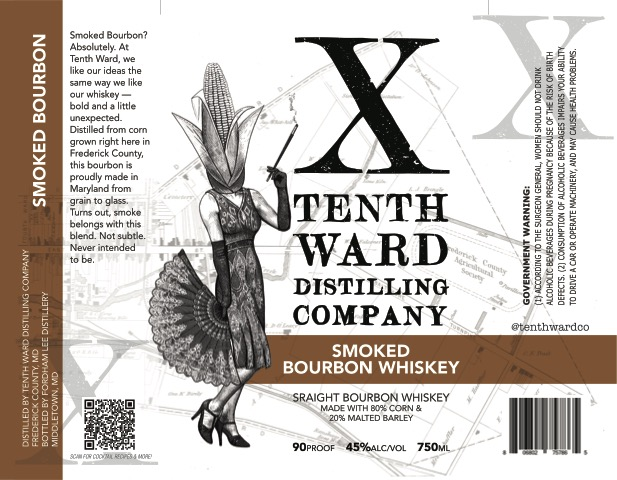

# TTB COLA Label Images - TTBID 26114001000727

**Brand Name:** TENTH WARD DISTILLING

**Fanciful Name:** SMOKED BOURBON WHISKEY

**Issue Date:** 05/01/2026

**Origin Code:** 25

**Product Class/Type:** 101

**Source:** [TTB Public COLA Registry](https://ttbonline.gov/colasonline/viewColaDetails.do?action=publicFormDisplay&ttbid=26114001000727)

## Label Images

### Label 1

## Extracted Label Text

*Text extracted via OCR - may contain errors*

### Label 1

Smoked Bourbon?
Absoltely. At
Tenth Werd, we
ike our ideas the
same way’

fur whiskey

bold and litle
unexpected
Distiled from com
grown right herein
Frederick Cou

this bourbon
proudly made in
Maryland from
drain to als.
Turns out, smoke
belongs with ths

= 2a WARD
DISTILLING
COMPANY

EVERAGES MRS YOR ALITY
1 AND HAY CRE HEATH PRALENS,

SMOKED BOURBON

TH)ACEORDNG To HE SURGEON Geena, won Siow. nor Be
‘NCOHOLC BEVERAGES DURING REGUNCY BES OF THEREOF BINH

GOVERNMENT WARNING:

erenthwardoo

SSRAIGHT BOURBON WHISKEY
NGOs MALTED BARE

9OPROo ABM%aLcvOL 75Ovi.
