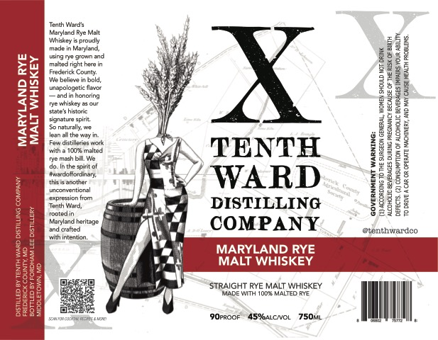

# TTB COLA Label Images - TTBID 26114001000729

**Brand Name:** TENTH WARD DISTIILLING

**Fanciful Name:** MARLAND RYE MALT WHISKEY

**Issue Date:** 04/30/2026

**Origin Code:** 25

**Product Class/Type:** 109

**Source:** [TTB Public COLA Registry](https://ttbonline.gov/colasonline/viewColaDetails.do?action=publicFormDisplay&ttbid=26114001000729)

## Label Images

### Label 1

## Extracted Label Text

*Text extracted via OCR - may contain errors*

### Label 1

Teeth Wars

‘Whey proudly

Maryland ye Male

aay

adem Movie

‘a

ea?

EH

w>

alta ight heen

ing arn an

m

Soe

ae

bers

Pat

Frederick Coun

wee

23

o5

au

We beleve bald

Zr

indinhonorng

mapoogate favor

$=

Sates hetore

‘ye whitey a ur

Beas

Sb

Sonate spit

aoue

ea

<<

Sonata we

age

ge

==

lean th ay.

Fw distil work

ge

BS

ge

wath 100% males

TENTH

a2

‘ye mean bat We

4p. Inthe spit of

ce

i

ge

tractor,

ge

os

theeanoter

jearertenl

5/ WARD

ge

A

28

expression fom

Tenth Ward,

DISTILLING

33

rootedin

Manjondbortoge

82

ET

and ated

18

COMPANY

exenthwandco

wath inten

f

MARYLAND RYE

MALT WHISKEY

STRAIGHT RYE MALT WHISKEY

BOPROoF AS%ALCWOL 750i

ll
