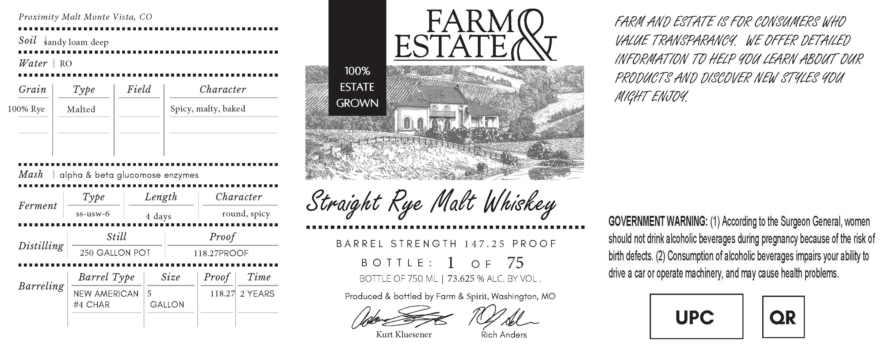

# TTB COLA Label Images - TTBID 26115001000004

**Brand Name:** FARM & ESTATE

**Issue Date:** 05/01/2026

**Origin Code:** 29

**Product Class/Type:** 109

**Source:** [TTB Public COLA Registry](https://ttbonline.gov/colasonline/viewColaDetails.do?action=publicFormDisplay&ttbid=26115001000004)

## Label Images

### Label 1

## Extracted Label Text

*Text extracted via OCR - may contain errors*

**Detected Proof:** 118.3
**Detected Age:** 2 Years

### Label 1

Proximity Malt Monte Vista, CO

eee

FARM AND ESTATE (8 FOR CONSUMERS WHO

FARM

Soil sandy loam deep

VALUE TRANSFAKANCY, WE OFFER DETAILED

eee

Water | RO

INFORMATION 70 HELP 90U LEARN ABOUT OUR

eee

100%

ES LALE

iy,

PRODUCTS AND DISCOVER NEW STULES YOU

Grain

Type

Field

Character

ESTATE

MIGHT ENJOY,

100% Rye

Malted

Spicy, malty, baked

YZ

Ml

ERE TAIS

ih

BER RRR RPP

ey,

FS

Mash

| alpha & beta glucomose enzymes

S2

BEER RR RRR RRR RRR

Character

Ferment

Type

Length

ss-usw-6

round, spicy

eee

4 days

Straight

Rye Malt Whiskey

BERBER RRR RRR RRR RRR PRR eee eee eee eee eee eee eee eee

GOVERNMENT WARNING: (1) According to the Surgeon General, women

Still

Proof

should not drink alcoholic beverages during pregnancy because of the risk of

Distilling

250 GALLON POT

118.27PROOF

BARREL STRENGTH 147.25 PROOF

birth defects. (2) Consumption of alcoholic beverages impairs your ability to

eee

BOTTLE:

1 OF

75

Barrel Type

Size

Proof | Time

BOTTLE OF 750 ML | 73.625 % ALC. BY VOL.

drive a car or operate machinery, and may cause health problems.

Barreling

NEW AMERICAN | 5

118.27) 2 YEARS

Produced & bottled by Farm & Spirit, Washington, MO

#4 CHAR

GALLON

Vibe ZY

Kurt Kluesener

Rich Anders

Tore) [ae
