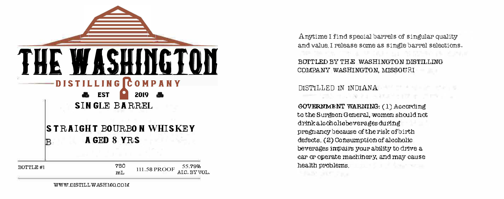

# TTB COLA Label Images - TTBID 26115001000005

**Brand Name:** THE WASHINGTON DISTILLING COMPANY

**Issue Date:** 04/30/2026

**Origin Code:** 29

**Product Class/Type:** 101

**Source:** [TTB Public COLA Registry](https://ttbonline.gov/colasonline/viewColaDetails.do?action=publicFormDisplay&ttbid=26115001000005)

## Label Images

### Label 1

## Extracted Label Text

*Text extracted via OCR - may contain errors*

**Detected Proof:** 111.6
**Detected Age:** 8 Years

### Label 1

Anytime [ find speoial barrels Of Singular quality
and value, I release some a5 Single barrel selections.
THE VIASHINGTON
BOITLED BY THE
WASHINGTON DISTLLIG
COMPANY
WASHINGTON, MISSOURI
DIS TILLING
0 MPAN Y
DISTILLED IN
INDIANA
EST
2019
SIN GLE
BA RREL
COVERNMENT WARMING: ( 1) According
to the Surgeon General, women should not
drinkalcqholicbeverages during
STRAIGHT BOURBO N
WHISKEY
pregrlancy because 0f the Yisk ofbirth
A GED 8 YRS
defects_ (2) Consumption Of alcoholic
beverages impajrs yourability tO drive &
car 0r operate machinery and may cause
BOTTLE #1
750
55.799
health problems ,
111.58 PROOF
mL
AIC. BY VOL=
WWW DISTILL WASHMGCOM
