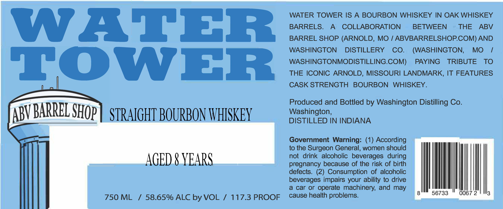

# TTB COLA Label Images - TTBID 26115001000007

**Brand Name:** WATERTOWER

**Issue Date:** 05/01/2026

**Origin Code:** 07

**Product Class/Type:** 101

**Source:** [TTB Public COLA Registry](https://ttbonline.gov/colasonline/viewColaDetails.do?action=publicFormDisplay&ttbid=26115001000007)

## Label Images

### Label 1

## Extracted Label Text

*Text extracted via OCR - may contain errors*

**Detected Proof:** 117.3
**Detected Age:** 8 Years

### Label 1

WATER TOWER IS A
BOURBON WHISKEY IN OAK WHISKEY
BARRELS.
A
COLLABORATION
BETWEEN
THE
ABV
BARREL SHOP (ARNOLD, MO
ABVBARRELSHOPCOM) AND
YSWER
WASHINGTON
DISTILLERY
CO_
(WASHINGTON,
MO
WASHINGTONMODISTILLING.COM)
PAYING
TRIBUTE
TO
THE ICONIC ARNOLD, MISSOURI LANDMARK, IT FEATURES
CASK STRENGTH
BOURBON
WHISKEY.
Produced and Bottled by Washington Distilling Co.
BARRL
STRAIGHT BOUrbOn WHISKEY
Washington,
DISTILLED IN INDIANA
Government Warning: (1) According
to the Surgeon General, women should
AGED 8 YEARS
not
drink   alcoholic beverages  during
pregnancy because of the risk of birth
defects. (2) Consumption
of alcoholic
beverages impairs
ability t0 drive
a
car or
operate machinery; and
750 ML
1
58.65% ALC by VOL
1
117.3 PROOF
cause health problems.
56733
0067 2
3
SHOP
ABV
your
may
