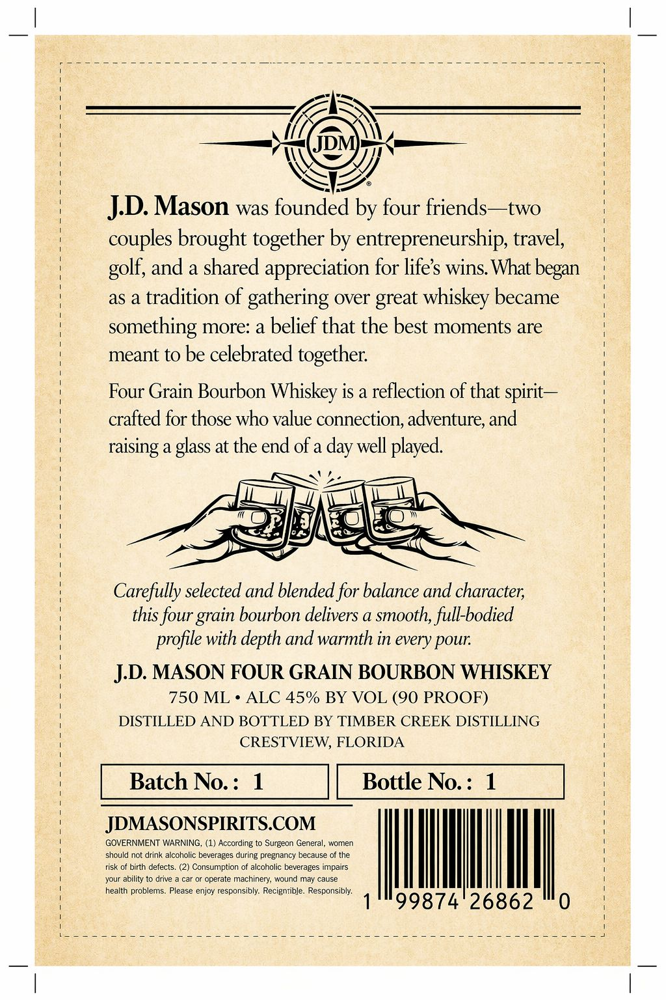
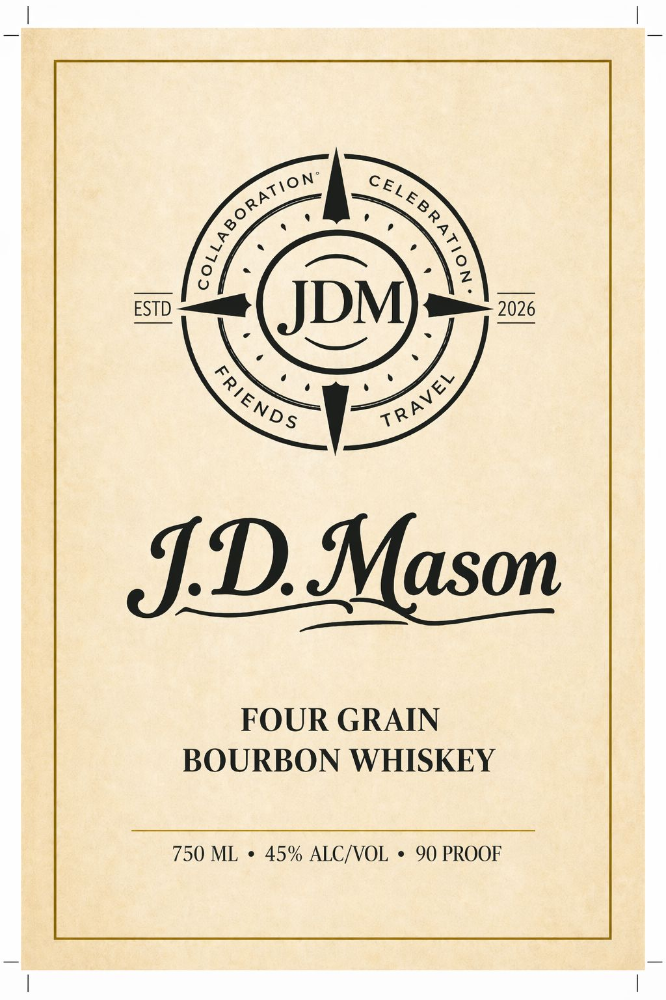

# TTB COLA Label Images - TTBID 26115001000052

**Brand Name:** J.D. MASON

**Issue Date:** 04/28/2026

**Origin Code:** 16

**Product Class/Type:** 141

**Source:** [TTB Public COLA Registry](https://ttbonline.gov/colasonline/viewColaDetails.do?action=publicFormDisplay&ttbid=26115001000052)

## Label Images

### Back Label

### Front Label

## Extracted Label Text

*Text extracted via OCR - may contain errors*

**Detected Proof:** 90

### Back Label

JD. Mason was founded by four friends--two
couples brought together by entrepreneurship, travel,
and a shared
appreciation for lifes wins What
as a tradition of gathering over great whiskey became
something more: a belief that the best moments are
meant to be celebrated
together:
Four Grain Bourbon Whiskey is a reflection of that spirit
crafted for those who value connection; adventure; and
raising a glass at the end of a
well played
Carefully selected and blended for balance and character;
this four _
bourbon delivers a smooth, full-bodied
with depth and warmth in every pour:
JD. MASON FOUR GRAIN BOURBON WHISKEY
750 ML
ALC 45% BY VOL (90 PROOF)
DISTILLED AND BOTTLED BY TIMBER CREEK DISTILLING
CRESTVIEW, FLORIDA
Batch No: :
1
Bottle No. =
1
JDMASONSPIRITS.COM
GOVERNMENT WARNING,
According to Surgeon General , women
should not drink alcoholic beverages during pregnancy because of the
risk of birth defects:
Consumption of alcoholic beverages impairs
your abilily t0 drive
operate machinery; wound may cause
health problems_
Please enjoy responsibly: Recignible. Responsibly.
99874'26862
golf,
began
day
grain
profile -

### Front Label

ESTD
JDM
2026
JDMason
FOUR GRAIN
BOURBON WHISKEY
750 ML
45% ALCIVOL
90 PROOF
oLLABORAT/oN
cELEB R,
1
FRIENDS
TRAVEL
