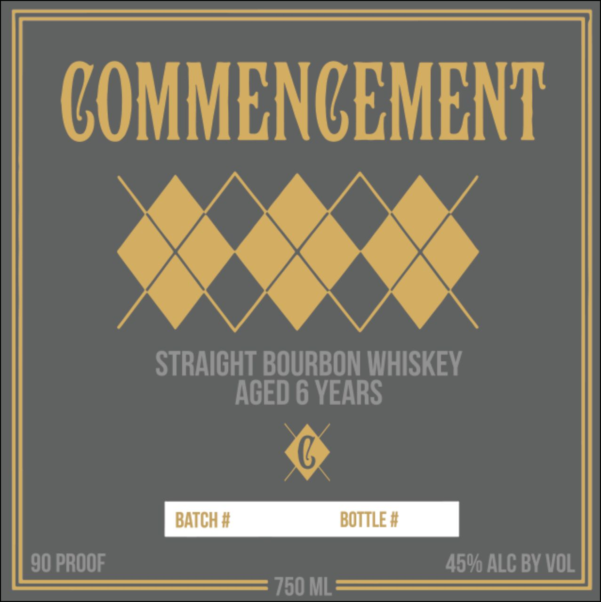

# TTB COLA Label Images - TTBID 26115001000055

**Brand Name:** COMMENCEMENT

**Issue Date:** 04/29/2026

**Origin Code:** 16

**Product Class/Type:** 101

**Source:** [TTB Public COLA Registry](https://ttbonline.gov/colasonline/viewColaDetails.do?action=publicFormDisplay&ttbid=26115001000055)

## Label Images

### Back Label

### Front Label

## Extracted Label Text

*Text extracted via OCR - may contain errors*

**Detected Proof:** 90
**Detected Age:** 6 Years

### Back Label

COMMENCEMENT
COMMENCEMENT
EXISTS
TO
MARK
LIFE'S
MILESTONES
CREATED
WITH
INTENTION
AND
PATIENCE , IT EMBODIES THE MOMENT BETWEEN THE
EXHALE OF ACCOMPLISHMENT AND THE INHALE OF
PREPARATION .
FOR
WHATEVER
COMES
NEXT .
BOTTLED BY TIMBER CREEK DISTILLING,
CRESTVIEW; FLORIDA
GOVERNMENT WARNING: (1) ACCORDING TO THE
SURGEON GENERAL , WOMEN SHOULD NOT DRINK
ALCOHOLIC BEVERAGES DURING PREGNANCY
BECAUSE OF THE RISK OF BIRTH DEFECTS. (2)
CONSUMPTION OF ALCOHOLIC BEVERAGES IMPAIRS
YOUR ABILITY TO DRIVE A CAR OR OPERATE
MACHINERY, AND MAY CAUSE HEALTH PROBLEMS
DRINKCOMMENCEMENT COM

### Front Label

COMMENCEMENT
STRAICHT BOURBON WHISKEY
ACED 6 YEARS
BATCH #
BOTTLE #
90 PROOF
459 ALC BV VOL
750 ML
