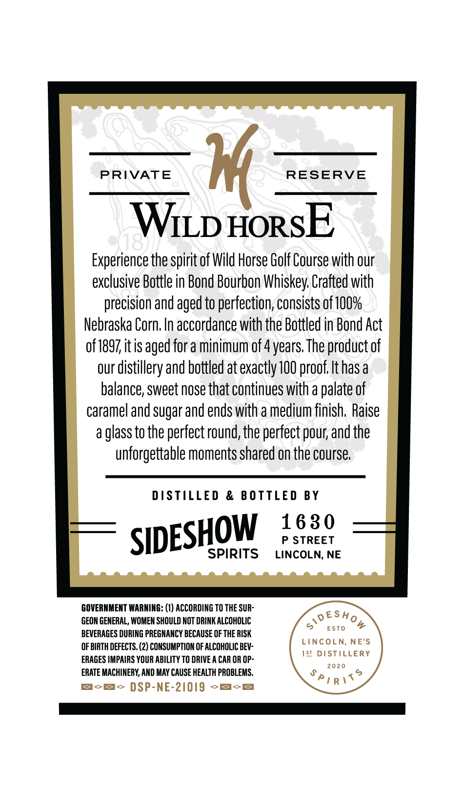
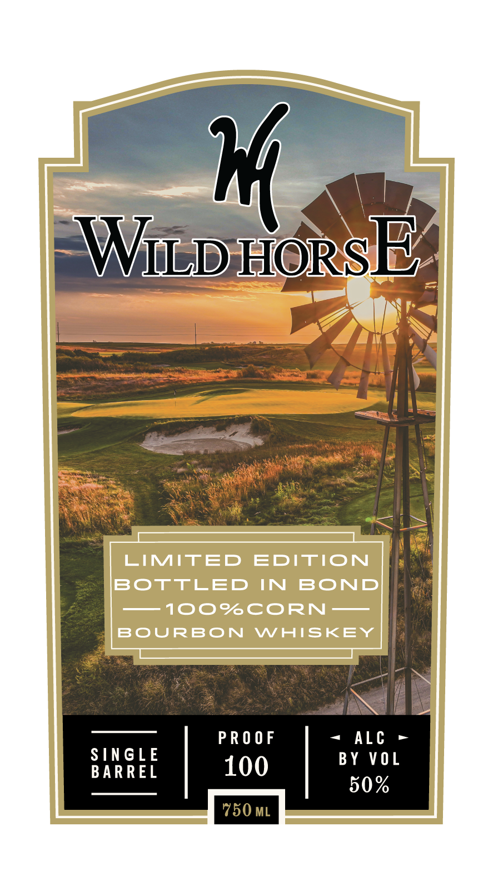

# TTB COLA Label Images - TTBID 26115001000129

**Brand Name:** WILD HORSE

**Issue Date:** 04/28/2026

**Origin Code:** 31

**Product Class/Type:** 111

**Source:** [TTB Public COLA Registry](https://ttbonline.gov/colasonline/viewColaDetails.do?action=publicFormDisplay&ttbid=26115001000129)

## Label Images

### Back Label

### Front Label

## Extracted Label Text

*Text extracted via OCR - may contain errors*

**Detected Proof:** 100
**Detected Age:** 4 Years

### Back Label

PRIVATE

RESERVE

Witp HorsE

Experience the spirit of Wild Horse Golf Course with our

exclusive Bottle in Bond Bourbon Whiskey. Crafted with

precision and aged to perfection, consists of 100%

Nebraska Corn. In accordance with the Bottled in Bond Act

of 1897, itis aged for a minimum of 4 years. The product of

our distillery and bottled at exactly 100 proof. Ithas a

balance, sweet nose that continues with a palate of

caramel and sugar and ends with a medium finish. Raise

a glass to the perfect round, the perfect pour, and the

unforgettable moments shared on the course.

DISTILLED & BOTTLED BY

1630

0

P STREET

SIDE

SPIRITS

LINCOLN, NE

GOVERNMENT WARNING: (1) ACCORDING TO THE SUR

oESHo

GEON GENERAL, WOMEN SHOULD NOT DRINK ALCOHOLIC

BEVERAGES DURING PREGNANCY BECAUSE OF THE RISK

> esto #

OF BIRTH DEFECTS. (2) CONSUMPTION OF ALCOHOLIC BEV-

LINCOLN, NE'S

ERAGES IMPAIRS YOUR ABILITY TO DRIVE A CAR OR OP-

1ST DISTILLERY

2020

ERATE MACHINERY, AND MAY CAUSE HEALTH PROBLEMS.

Pigit?

rome DSP-NE-21019 mom

### Front Label

1
WLHoRSE
LIMITED
EDITION
BOTTLED
IN
BOND
100%CORN-
BoURBON
WHISKEY
P R 0 0 F
ALc
SINGLE
BY V0 L
BARREL
100
50%
750 ML
