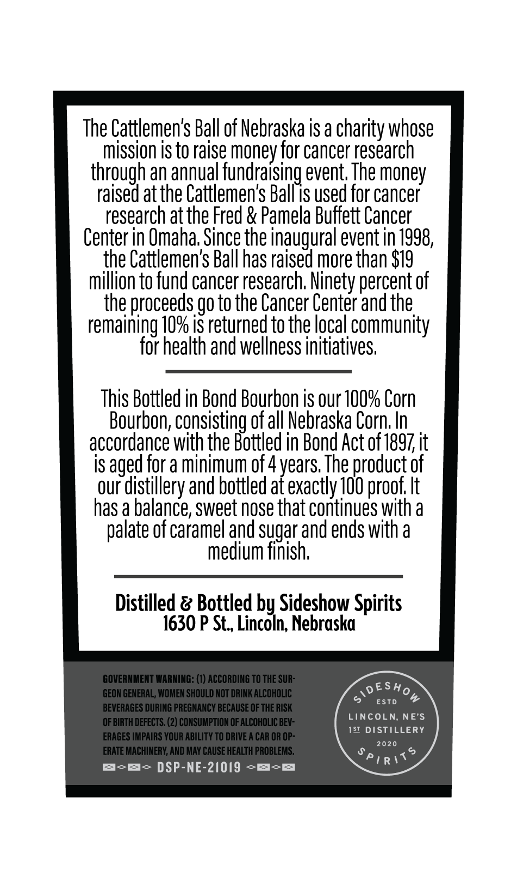
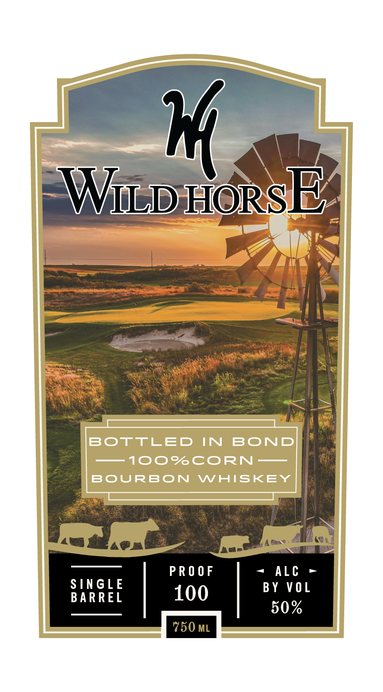

# TTB COLA Label Images - TTBID 26115001000131

**Brand Name:** WILD HORSE

**Issue Date:** 04/28/2026

**Origin Code:** 31

**Product Class/Type:** 111

**Source:** [TTB Public COLA Registry](https://ttbonline.gov/colasonline/viewColaDetails.do?action=publicFormDisplay&ttbid=26115001000131)

## Label Images

### Back Label

### Front Label

## Extracted Label Text

*Text extracted via OCR - may contain errors*

*1 image(s) excluded: text did not meet readability threshold*

**Detected Age:** 4 Years

### Back Label

The Cattlemen's Ball of Nebraska is a charity whose
mission is to raise money for cancer research
#ageda
an annual fundraising event; The money
atthe Cattlemen's Ballis used for cancer
research atthe Fred & Pamela Buffett Cancer
Center in Omaha; Since the inaugural event in 7998,
the Cattlemen's Ball has raised more than $19
million to fund cancer research;
'percent of
the proceeds go to the Cancer Center and the
remaining /0% is returned to the local community
for health and wellness initiatives;
This Bottled in Bond Bourbon is our IOO% Corn
Bourbon, consisting ofall Nebraska Corn In
accordance with the Bottled in Bond Act 0f 1897it
is aged for a minimum of 4 years The product of
our
'distillery and bottled at exactly j0O proof; It
has a balance; sweet nose that continues with a
of caramel and
and ends with a
medium
Tsunashr
Distilled & Bottled by Sideshow Spirits
1630 P St_ Lincoln; Nebraska
GOVERNMENT WARNING: (0) ACCORDING TO THE SUR-
GEON GENERAL; WOMEN SHOULD NOT DRINK ALCOHOLIC
> DEs#o4
ESTD
BEVERAGES DURING PREGNANCY BECAUSE OF THE RISK
LincoLn; NE'S
OF BIRTH DEFECTS. (2) CONSUMPTION OF ALCOHOLIC BEV-
IS1 DISTiLLERY
ERAGES IMPAIRS YOUR ABILITY TO DRIVE
CAR OR OP-
2020
ERATE MACHINERY; AND MAY CAUSE HEALTH PROBLEMS;
JpiR /<5
DSP-NE-21019
~pp
Ninety '
palate -
