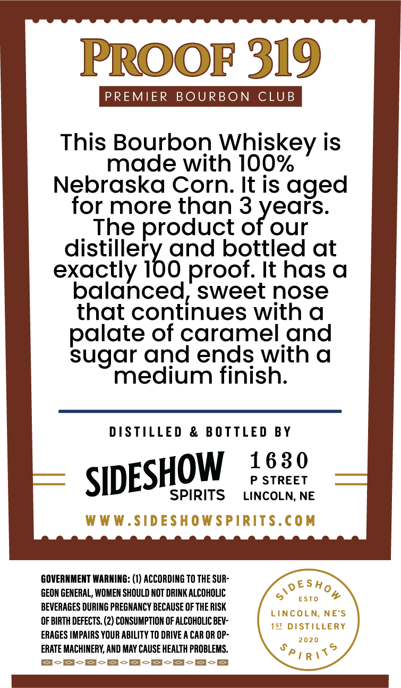
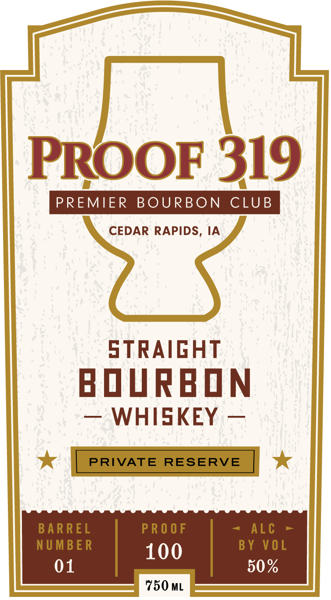

# TTB COLA Label Images - TTBID 26115001000132

**Brand Name:** PROOF 319

**Issue Date:** 04/30/2026

**Origin Code:** 31

**Product Class/Type:** 101

**Source:** [TTB Public COLA Registry](https://ttbonline.gov/colasonline/viewColaDetails.do?action=publicFormDisplay&ttbid=26115001000132)

## Label Images

### Back Label

### Front Label

## Extracted Label Text

*Text extracted via OCR - may contain errors*

**Detected Proof:** 100
**Detected Age:** 3 Years

### Back Label

PROOF 319

PREMIER BOURBON CLUB

This Bourbon Whiskey is
made with 100%
Nebraska Corn. It is aged
for more than 3 years.

_ The product of our
distillery and bottled at
exactly 100 proof. It has a
balanced, sweet nose
that continues with a
palate of caramel and
sugar and ends with a
medium finish.

DISTILLED & BOTTLED BY

SIDESHOW 182°

SPIRITS LINCOLN, NE

GOVERNMENT WARNING: (1) ACCORDING TO THE SUR-
GEON GENERAL, WOMEN SHOULD NOT DRINK ALCOHOLIC

BEVERAGES DURING PREGNANCY BECAUSE OF THE RISK

OF BIRTH DEFECTS. (2) CONSUMPTION OF ALCOHOLIC BEV-
ERAGES IMPAIRS YOUR ABILITY TO DRIVE A CAR OR OP-
ERATE MACHINERY, AND MAY CAUSE HEALTH PROBLEMS,
BcS-S-S-S-S-S-S-8

### Front Label

PROOF 319
PREMIER
BOURBON
CLUB
CEDAR RAPIDS, IA
STRAIGHT
BDURBDN
WHISKEY
PRIVATE
RESERVE
BAR REL
PR O 0 F
ALc
NUMBER
100
BY VOL
01
50%
750 ML
