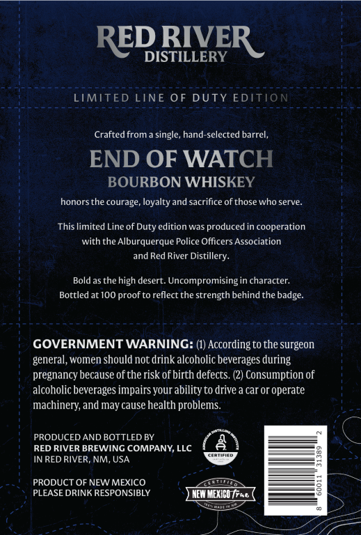
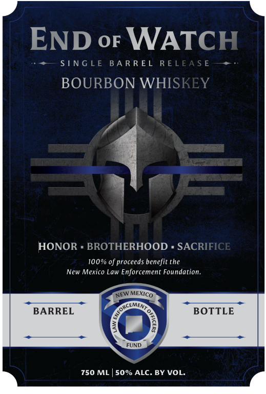

# TTB COLA Label Images - TTBID 26116001000017

**Brand Name:** END OF WATCH

**Fanciful Name:** SINGLE BARREL RELEASE BOURBON WHISKEY

**Issue Date:** 04/28/2026

**Origin Code:** 34

**Product Class/Type:** 141

**Source:** [TTB Public COLA Registry](https://ttbonline.gov/colasonline/viewColaDetails.do?action=publicFormDisplay&ttbid=26116001000017)

## Label Images

### Back Label

### Front Label

## Extracted Label Text

*Text extracted via OCR - may contain errors*

**Detected Proof:** 100

### Back Label

DRIVE

RE

DISTILLERY

R

RDG eae sees

LIMITED LINE OF DUTY EDIT!

Thies Se Bias Soe. 1a

Crafted from a single, hand-selected barrel,

END OF WATCH

BOURBON WHISKEY

honors the courage, loyalty and sacrifice of those who serve.

This limited Line of Duty edition was produced in cooperation

with the Alburquerque Police Officers Association

and Red River Distillery.

Bold as the high desert. Uncompromising in character.

Bottled at 100 proof to reflect the strength behind the badge.

:

GOVERNMENT WARNING: (t) According to the surgeon

general, women should not drink alcoholic beverages during

pregnancy because of the risk of birth defects. (2) Consumption of

alcoholic beverages impairs your ability to drive a car or operate

machinery, and may cause health problems.

uC

PRODUCED AND BOTTLED BY

as

RED RIVER BREWING COMPANY, LLC

IN RED RIVER, NM, USA

@

pes

PRODUCT OF NEW MEXICO

©. PLEASE DRINK RESPONSIBLY

;

oat

LILLE

### Front Label

END oF WATCH

++— SINGLE BARREL REL

BOURBON WHIS

HONOR « BROTHERHOOD = SACRI

100% of proceeds benefit the
New Mexico Law Enforcement Foundation.

BARREL BOTTLE

750 ML | 50% ALC. BY VOL.
