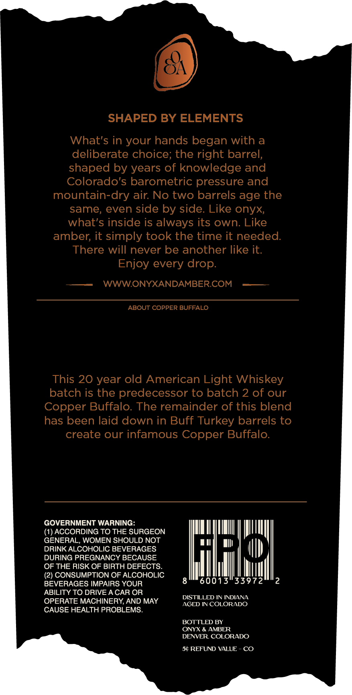
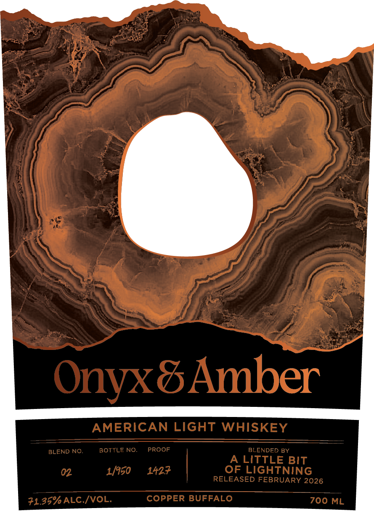

# TTB COLA Label Images - TTBID 26117001000143

**Brand Name:** ONYX & AMBER

**Issue Date:** 05/01/2026

**Origin Code:** 13

**Product Class/Type:** 144

**Source:** [TTB Public COLA Registry](https://ttbonline.gov/colasonline/viewColaDetails.do?action=publicFormDisplay&ttbid=26117001000143)

## Label Images

### Back Label

### Front Label

## Extracted Label Text

*Text extracted via OCR - may contain errors*

**Detected Proof:** 142.7
**Detected Age:** 20 Years

### Back Label

SHAPED BY ELEMENTS
What's in your hands began with a
deliberate choice; the right barrel;
shaped by years of knowledge and
Colorado's barometric pressure and
mountain-dry air No two barrels age the
same, even side by side. Like onyx
what's inside is always its own: Like
amber; it simply took the time it needed:
There will never be another like it:
Enjoy every drop:
WWWONYXANDAMBERCOM
ABOUT COPPER BUFFALO
This 20 year old American Light Whiskey
batch is the predecessor to batch 2 of our
Copper Buffalo. The remainder of this blend
has been laid down in Buff Turkey barrels to
create our infamous Copper Buffalo:
GOVERNMENT WARNING:
(1) ACCORDING TO THE SURGEON
GENERAL, WOMEN SHOULD NOT
DRINK ALCOHOLIC BEVERAGES
DURING PREGNANCY BECAUSE
OF THE RISK OF BIRTH DEFECTS
(2) CONSUMPTION OF ALCOHOLIC
BEVERAGES IMPAIRS YOUR
60013"33972
ABILITY TO DRIVE A CAR OR
DISTILLED IN INDIANA
OPERATE MACHINERY AND MAY
AGED NN COLORADO
CAUSE HEALTH PROBLEMS.
BOTTLED BY
ONYX & AMBER
DENVER COLORADO
54 REFUND VALUE
CO

### Front Label

Onyx8Amber
AMERICAN LIGHT
WHISKEY
BLEND NO.
BOTTLE NO.
PROOF
BLENDED BY
LITTLE BIT
02
1/950
1427
OF LIGHTNING
RELEASED FEBRUARY 2026
71.35%ALC /VOL
COPPER BUFFALO
700 ML
