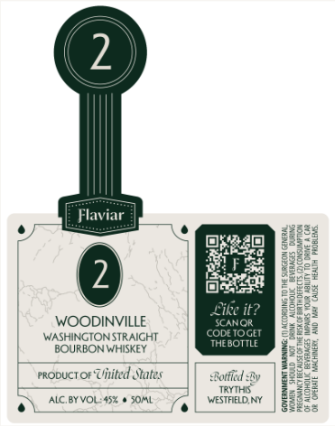

# TTB COLA Label Images - TTBID 26117001000151

**Brand Name:** FLAVIAR

**Issue Date:** 05/04/2026

**Origin Code:** 02

**Product Class/Type:** 101

**Source:** [TTB Public COLA Registry](https://ttbonline.gov/colasonline/viewColaDetails.do?action=publicFormDisplay&ttbid=26117001000151)

## Label Images

### Front Label

## Extracted Label Text

*Text extracted via OCR - may contain errors*

### Front Label

ry I Pree
r sar) Peer
Ones bard

cw oS.

eet ees

mane Pee

WOODINVILLE scoxot eet
WASHINGTONSTRAIGHT concioce (Eg
BOURBON WHISKEY a |:
rropucr or Uhited Sates orf ty | peBe2
ws | 22388

C 750K meow | B§8e
D\Nemvoue exon 7% | was be
