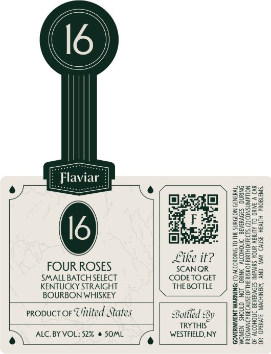

# TTB COLA Label Images - TTBID 26117001000152

**Brand Name:** FLAVIAR

**Issue Date:** 04/28/2026

**Origin Code:** 02

**Product Class/Type:** 101

**Source:** [TTB Public COLA Registry](https://ttbonline.gov/colasonline/viewColaDetails.do?action=publicFormDisplay&ttbid=26117001000152)

## Label Images

### Front Label

## Extracted Label Text

*Text extracted via OCR - may contain errors*

### Front Label

/

\{

\

I6 )

wee

F laviai

=

223s

2285

EE

a

Oj

gaz

Ssec3

2225

ae

ee

re

Aes

gee.

3925

fd

F

5

Rated

S85)

ee

El]

gee

&

“é

ve

23

2353

gees

Like it?

S=f2

=

5SES=

FOUR ROSES

SCANQR

=e

Zo

SMALL BATCH SELECT

CODETOGET

gS=

KENTUCKY STRAIGHT

THE BOTTLE

SEGe

BOURBON WHISKEY

ZeSe=

25528

5928

asae

proouct oF Uitited States

ge

238.

Boke

Bo

Sa

Bottled By

Bese

TRYTHIS

g2395

2-255

252

gs

e) ALC. BY VOL::52% @ SOML

)

WESTFIELD, NY

8Se65

32255
