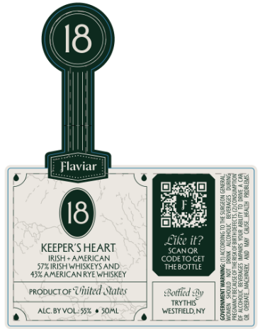

# TTB COLA Label Images - TTBID 26117001000155

**Brand Name:** FLAVIAR

**Issue Date:** 05/05/2026

**Origin Code:** 02

**Product Class/Type:** 140

**Source:** [TTB Public COLA Registry](https://ttbonline.gov/colasonline/viewColaDetails.do?action=publicFormDisplay&ttbid=26117001000155)

## Label Images

### Front Label

## Extracted Label Text

*Text extracted via OCR - may contain errors*

### Front Label

(18

Flavia

_

aye

‘=

Ge

aro

fort

KEEPER'S HEART

STSIRISH WHISKEYS AND

IRISH AMERICAN.

aL

49% AMERICAN RYE WHISKEY

propuctor Uitited States

ane

i

ALC.BY VOL-55% # SOML

WESTFIELD NY

ere cad aees

fo
